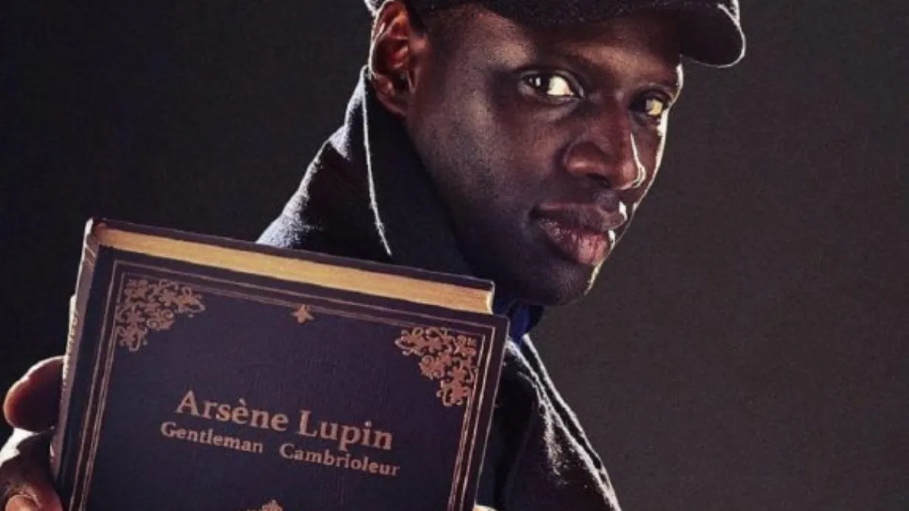
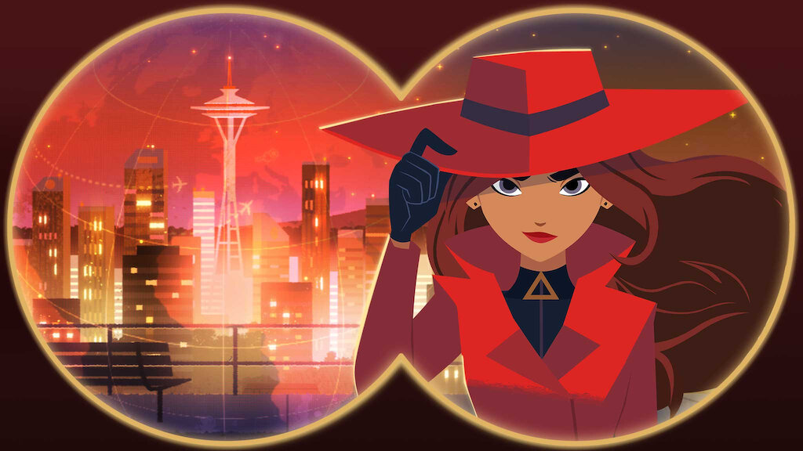

# Quien Eres
Un antiguo criminal ¿reconvertido? al lado de los buenos. O eso parece. Por ahora...

# Pillalo si

...Te gusta tener un pasado algo oscuro.
...Quieres romper la ley.
...Te gustan las películas de atracos/golpes.

# Puedes ser cómo...

## Lupin (Lupin)

En cualquier serie o película, Lupin es el prototipo de caballero: Educado, galante, cortés. Desprecia la violencia y ve cualquier golpe como un reto. El golpe ha de tener motivos personales o ser retador, pero nunca merece la pena si alguien va a salir dañado. Puede ser un ladrón, pero desde luego no es un asesino. Eso no quiere decir que no puedas defenderte, pero no vas a matar por ningún motivo. (Salvo que sea por venganza).

En la cárcel no tienen Netflix. Por eso, cuando el último trabajo salió mal y se acercó PRIS-13 ofreciendo una amnistía a cambio de trabajar para ellos 2 años, no tuviste que pensártelo. ¿Quién iba a decirlo? Parece que tus habilidades son compatibles con tener una nómina del gobierno.

Catchphrase: "Prometí que esta vez iba a portarme bien..."

## Parker (Las reglas del Juego)

Como Parker puedes ser un experto ladrón, capaz de llevar a cabo cualquier golpe... Y, al mismo tiempo, completamente disfuncional para la vida "normal". Toda tu vida se ha centrado en grandes robos y has dejado fuera todo lo demás, lo que te da una personalidad "única". Impulsiva, desconfiada y bastante obsesiva.

<!-- Catchphrase: "¿Por qué todos mirais para mí? Vale, toma." -->

## Carmen Sandiego (Carmen Sandiego)

O quizás, como Carmen fuiste criada por una organización para cometer todo tipo de crímenes. Ahora, roba solo para ayudar a los demás. Tienes muchas habilidades, pero solo las usas si la causa es justa. Y siempre con un plan detrás.
