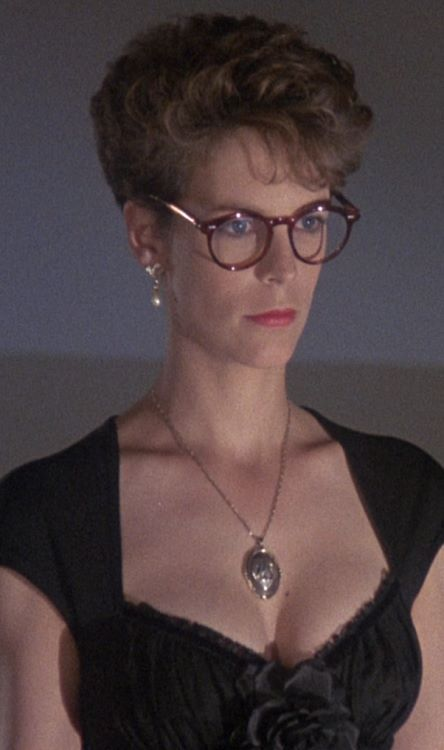
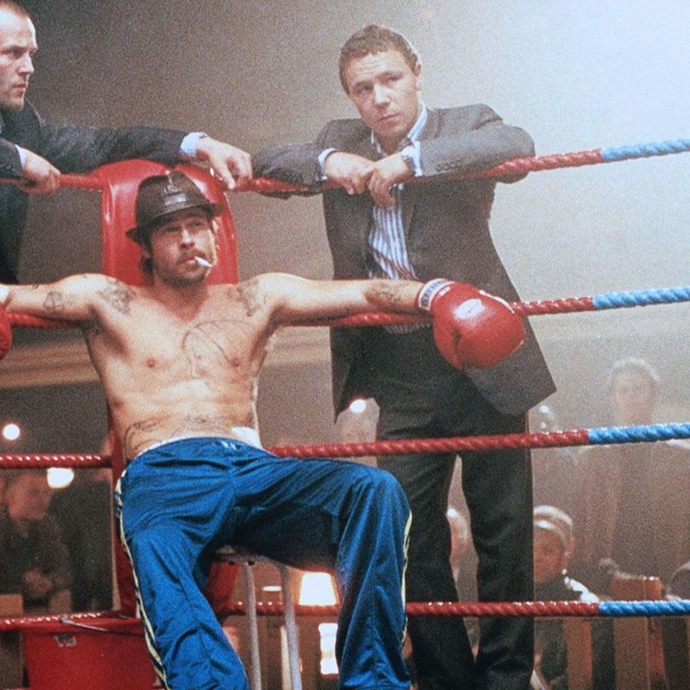

# Quien Eres
Eres el Face, especialista en salir de cualquier problema hablando. Aunque en principio el rol te puede echar atrás si eres novato, no te preocupes. Habla con tus GMs y ellos te ayudarán a enfocarlo: No es tán difícil, solo tienes que recordar a todos esos grandes timadores de las pelis y decirle lo que quieres hacer a los GMs.

# Pillalo si...
- ...Te gusta dejar a los villanos con un palmo de narices mientras te vas de rositas.
- ...Prefieres que otros hagan el trabajo por tí.
- ...Te molan las pelis de timadores.

# Puedes ser cómo...

## Wanda (Un pez llamado Wanda)

"Camaleónica" ni siquiera empieza a describirte. Puedes meterte en la piel de cualquier personaje, seducir a cualquiera y ser quien quieras. No sueles tener demasiado aprecio por los sentimientos de los demás, lo cual te ha granjeado bastantes enemigos. Pero te gusta pagar tus deudas y devolver los favores. La organización no te reclutó: Te infiltraste en ella y cuando viste que te interesaba, "presentaste" tu curriculum.

Si decides ser como Wanda, tu catchphrase será: "Disculpe, su cara me resulta familiar...".

## Mickey O'Neill (Snatch: Cerdos y Diamantes)

Campeón callejero de Boxeo sin guantes, te conoces al dedillo todos los tugurios de apuestas clandestinas del Reino Unido. Te has unido a la organización porque te persiguen todos los mafiosos de Londres por amañar los combates con el resto de tu familia. Los echas de menos, pero desaparecer y que te dieran por muerto era la mejor opción para todos. 

Además de ser un hacha en la lucha y sabiendo cuándo tirarte en la lona (y cuando no), tienes bastante labia y eres capaz de salir de muchas situaciones mintiendo, engañando y timando. 

Si decides ser como Mikey, tu catchphrase será: "Buen golpe, ahora me toca a mí..."
