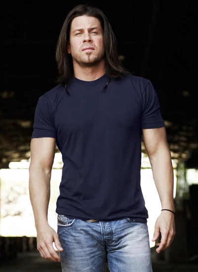

# Quien Eres
Eres el Face, especialista en salir de cualquier problema hablando. Aunque en principio el rol te puede echar atrás si eres novato, no te preocupes. Habla con tus GMs y ellos te ayudarán a enfocarlo: No es tán difícil, solo tienes que recordar a todos esos grandes timadores de las pelis y decirle lo que quieres hacer a los GMs.

# Pillalo si...
- ...Te gusta dejar a los villanos con un palmo de narices mientras te vas de rositas.
- ...Prefieres que otros hagan el trabajo por tí.
- ...Te molan las pelis de timadores.

# Puedes ser cómo

## Elliot Spencer (Las reglas del Juego)

Un tipo duro con un corazón de oro. Has visto todos los conflictos del mundo, has estado en casi todos ellos y los odias con toda tu alma. Te has unido a la organización sólo por que por una vez te da la oportunidad de proteger a los más débiles. Aunque tu especialidad son los puños, prefieres no pelear y resolver las peleas con tu carisma. Tú no empiezas las peleas, pero siempre las termnias.

Si decides ser como Elliot, tu catchphrase será: "No me gustan las pistolas".

## Mickey O'Neill (Snatch: Cerdos y Diamantes)

Campeón callejero de Boxeo sin guantes, te conoces al dedillo todos los tugurios de apuestas clandestinas del Reino Unido. Te has unido a la organización porque te persiguen todos los mafiosos de Londres por amañar los combates con el resto de tu familia. Los echas de menos, pero desaparecer y que te dieran por muerto era la mejor opción para todos. 

Además de ser un hacha en la lucha y sabiendo cuándo tirarte en la lona (y cuando no), tienes bastante labia y eres capaz de salir de muchas situaciones mintiendo, engañando y timando. 

Si decides ser como Mikey, tu catchphrase será: "Buen golpe, ahora me toca a mí..."
