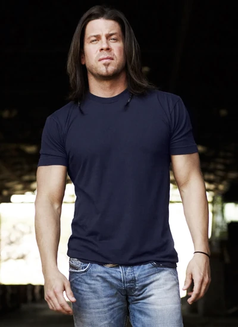
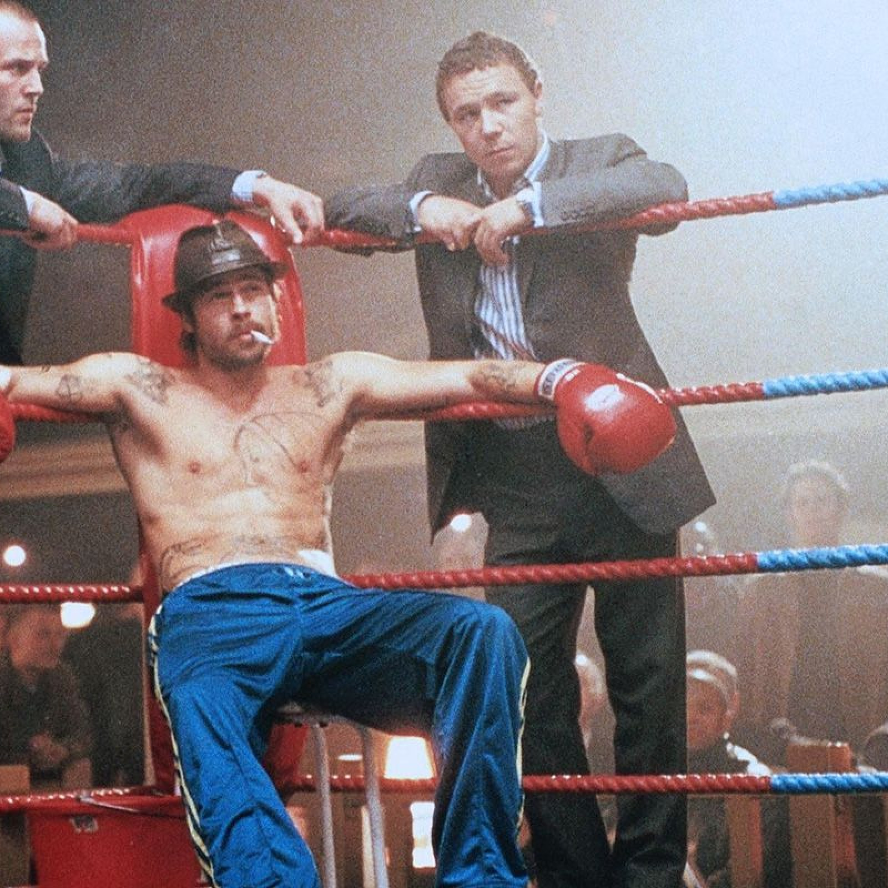

# Quien Eres
Eres el fighter, especialista en cuerpo a cuerpo. Aunque haces más cosas, las peleas son lo tuyo. 

# Pillalo si...
- ...Quieres meterte en la gresca el primero.
- ...Prefieres los puños y la velocidad a las armas de fuego.
- ...Te molan las pelis de Artes Marciales.

# Puedes ser cómo

## Elliot Spencer (Las reglas del Juego)

Un tipo duro con un corazón de oro. Has visto todos los conflictos del mundo, has estado en casi todos ellos y los odias con toda tu alma. Te has unido a la organización sólo por que por una vez te da la oportunidad de proteger a los más débiles. Aunque tu especialidad son los puños, prefieres no pelear y resolver las peleas con tu carisma. Tú no empiezas las peleas, pero siempre las terminas.

Si decides ser como Elliot, tu catchphrase será: "No me gustan las pistolas".

## Mickey O'Neill (Snatch: Cerdos y Diamantes)

Campeón callejero de Boxeo sin guantes, te conoces al dedillo todos los tugurios de apuestas clandestinas del Reino Unido. Te has unido a la organización porque te persiguen todos los mafiosos de Londres por amañar los combates con el resto de tu familia. Los echas de menos, pero desaparecer y que te dieran por muerto era la mejor opción para todos. 

Además de ser un hacha en la lucha y sabiendo cuándo tirarte en la lona (y cuando no), tienes bastante labia y eres capaz de salir de muchas situaciones mintiendo, engañando y timando. 

Si decides ser como Mikey, tu catchphrase será: "Buen golpe, ahora me toca a mí..."

