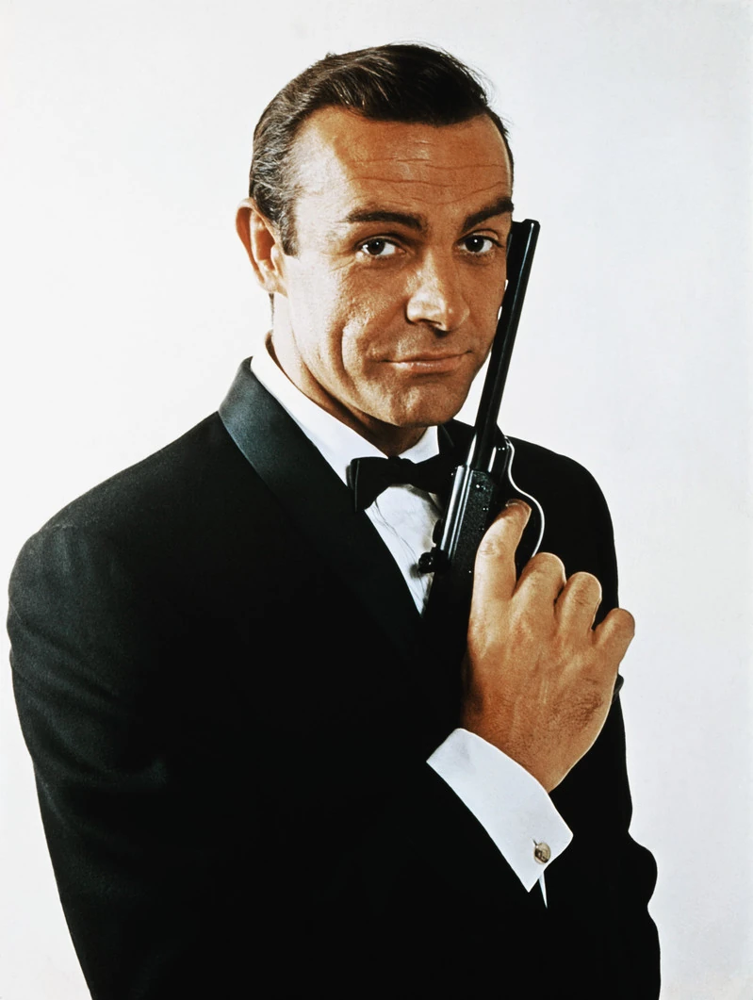
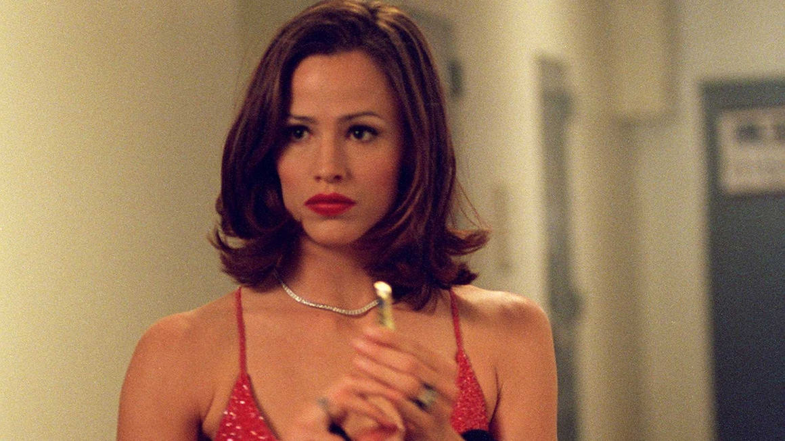
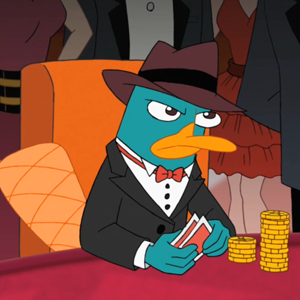

# Quien Eres
Eres el espía. Trabajando para una organización o para tu país.

# Pillalo si

...Te gustan los personajes misteriosos y sofisticados.
...Quieres tener licencia para matar.
...Te gustan las películas de espías.

# Puedes ser cómo...
¡Es un juego de rol! Puedes hacer que tu personajte tenga la personalidad que quieras. Aprovecha esto a tu favor y copia los rasgos de personalidad de los espías de los comics, pelis o series que más te gusten!. Aquí abajo te dejo algunos ejemplos:

## James Bond (007)

Puedes ser como el superespía James Bond: preparado, carismático y quizás un poco arrogante. Si te vas a las películas clásicas, ándate con cuidado que muchas de las cosas de esa época dan mucho "Cringe".

<!-- Catchphrase: "Imposible es lo que hago de 9 a 6". -->

## Sydney Anne Bristow (Alias)

O quizás puedes ser como Alias: Efectiva e implicada pero más analítica, reflexiva (y quizás algo paranóica). Una persona que no evita la acción pero no lo resuelve todo con un tiroteo si hay alternativas mejores. Como decía Asimov "La violencia es el último recurso del incompetente".

<!--Catchphrase: "No deberías confiar en mi"  -->

## Agente P (Phineas y Ferb)

¡El hecho de que no seas un ornitorrinco no quiere decir que no puedas copiar la personalidad de uno de los mejores superespías de la historia!. No podrás tener un pico ni un espolón venenoso, pero puedes ser valiente, callado y tranquilo. Alguien que está detrás hasta que los malos llegan y entonces se convierte en una vorágine de movimiento.
