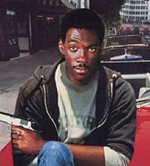

# The Agent / El agente

## Quien Eres

Eres el Agent, una persona que trabaja algún tipo de agencia gubernamental: FBI, Policía, Departamento del Sheriff, etc. Algunos de ellos siguen las reglas y defienden la ley y el orden, otros son impulsivos en busca de justicia.

## Pillalo si...
- ...Te gusta tener autoridad.
- ...No solo quieres pegar tiros, también quieres proteger a los demás.
- ...Te molan las pelis policiacas.

## Puedes ser cómo...
Afortunadamente, hay muchísimos ejemplos de policías o agentes del gobierno a lo largo de las películas o series. Toma cosas de todos los que te gusten y hazte tu propia personalidad. Aquí te damos algunos ejemplos para que te inspires:

### Detective Rosa Díaz (Brooklyn 99)

Eres una detective dura, criada en las calles. No aguantas gilipolleces y estás aquí para hacer tu trabajo, no para hacer amigos. Respetas a los ciudadanos pero ahi de cualquier delincuente que se cruce en tu camino. Aún así, entiendes que hay una organización y una jerarquía y la cumples (a tu manera).

La agencia te reclutó a través del departamento de policía en el que trabajabas. Ahora, compaginas tu tiempo como policía con un trabajo extra salvando el mundo.

Si decides ser como Rosa, tu catchphrase será: *Los planes son planes. Soy dura, no un anarquista.*

### Detective Axel Folly (Superdetective en Hollywood)

Te criaste en un barrio malo de Detroit y acabaste llegando a Policía. Lo hiciste con la intención de proteger tu comunidad y, en la medida de lo posible lo estás haciendo. El problema de ser poli en Detroit es que no hay dinero y hay que buscar soluciones imaginativas a las cosas. Afortunadamente, tu tienes ese don además de una sonrisa impertérrita y la capacidad de tomartelo todo a cachondeo.

Todavía no tienes muy claro por qué te reclutó la organización ni si encajas del todo aquí, pero está claro que alguien tiene que ayudar a este grupo de estirados a relajarse un poco mientras hacen su trabajo.

Si decides ser como Axel, tu catchphrase será: *No se preocupe no estoy de servicio. Estoy de vacaciones.*

### Yuri Briar (Spy x Family)

Yuri no trabaja como agente de policía... Trabaja para el servicio secreto, encontrando y destapando a espías enemigos en su país. Es incansable y tiene una fortaleza mental y física extremas. Se crió como huérfano y su hermana se desvivía porque Yuri sobreviviera, lo que hace que tenga una lealtad a su familia inquebrantable (y también a su país). Claro que todo esto no lo hizo la persona más sociable del mundo: a veces es demasiado agresivo y pierde la paciencia demasiado rápido.

<!---
### Sgt. Roger Murtaugh (Arma letal)

Eres un buen policia y aunque prefieres resolver los conflictos siguiendo las reglas, eres flexible si el bien comun lo requiere. A punto de jubilarte, hace unos años fuiste reclutado por la agencia ya que te involucraste en un incidente y te viste obligado a abandonar tu identidad y tu familia a la que echas de menos.

Debido a tu experiencia, tu papel principal en el equipo sera el de liderarlos.

Si decides ser como el Sgt. Murtaugh, tu catchphrase será: *Estoy demasiado viejo para esta mierda*

### Dana Scully (Expediente X)

Eres una agente especial del FBI que en este momento se encuentra dando apoyo a la agencia. Si bien eres exceptica en lo referente a asuntos paranormales, tu paso por los *Expedientes X* te ha llevado a cuestionarlo.

Aunque tienes estudios de grado en fisica y en medicina, decidiste alistarte al FBI porque te parecio mas interesante.

Si decides ser como Dana Scully, tu catchphrase será: *La verdad está ahí afuera, pero también las mentiras.*
<!---
