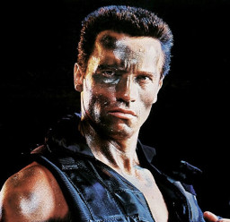
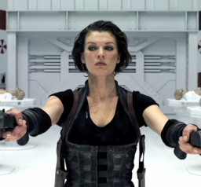

# The Commando / El Comando

## Quien Eres

Eres el Commando, un soldado curtido en mil batallas. La persona dura, experta en armas y que ha visto todo.

## Pillalo si

...Quieres un personaje que sea directo.
...Te gustan las armas grandes.
...Te gustan las pelis de Acción con muchos tiros.

## Puedes ser cómo...

En las pelis de acción, hay mil ejemplos de luchadores duros que disparaban balas como el que tira caramelos en la cabalgata de reyes. Solo piensa un poco, escoge algunos de tus favoritos y piensa en qué te gustaba de ellos. Toma lo que más me guste y construye tu personalidad en consecuencia. Aquí te dejamos algunos ejemplos para que te sea más sencillo.

### Jonh Matrix (Commando)

El epítome de tipo duro de los ochenta. Solo podrías ser más ochentero si llevaras calentadores, un walkman y una tonelada de laca. Duro, silencioso, siempre con la frase lapidaria en la boca. Protector con su familia, leal a su país o su organización y dado a la violencia calculada. ¿Para qué vas a conseguir las cosas hablando si se pueden arreglar de dos hostias?.

Tras darte cuenta de que la organización a la que dedicaste tu vida estaba dirigida por corruptos y chupatintas, te fuiste sin mirar atrás. Desengañado, pasaste un tiempo vagando por Madripur e Indonesia.

Lo malo de ser un soldado honrado es que no haces mucho dinero, así que tuviste que volver a activo. PRIS-13 es una de los grupos con las que colaboraste en el pasado y te parecían decentes, quizá un poco más secretista de lo que te gustaría, pero al menos parece que mantienen el hocico limpio.

### Alice Abernathy (Resident Evil)

Superviviente nata, nada puede contigo: ni corporaciones malignas, ni virus asesinos, ni paramilitares armados. Usas la violencia cuando hay motivos serios para ello (casualmente pareces atraer a los motivos serios, pero eso es una cuestión para otro día). Eso no quiere decir que no puedas estar en familia, pero tiendes a distanciarte de la gente. Los amigos de hoy pueden llegar a ser los objetivos del mañana, así que ¿Por qué molestarse?

PRIS-13 lleva un tiempo en tu radar así que, cuando intentaron reclutarte, no te resististe demasiado. Nadie está tan limpio como ellos afirman que están. No has encontrado nada sospecho (de momento), pero algo no te cuadra. Así que vas a mantener los ojos abiertos y, si se da la ocasión, mirar debajo de la alfombra.

Catchphrase: "Matarte no arreglará las cosas, pero es un comienzo."
