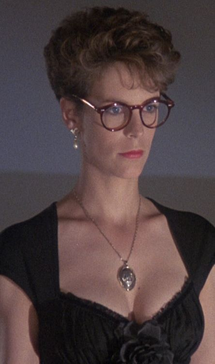

# Quien Eres
Eres el Face, especialista en salir de cualquier problema hablando. Aunque en principio el rol te puede echar atrás si eres novato, no te preocupes. Habla con tus GMs y ellos te ayudarán a enfocarlo: No es tán difícil, solo tienes que recordar a todos esos grandes timadores de las pelis y decirle lo que quieres hacer a los GMs.

# Pillalo si...
- ...Te gusta dejar a los villanos con un palmo de narices mientras te vas de rositas.
- ...Prefieres que otros hagan el trabajo por tí.
- ...Te molan las pelis de timadores.

# Puedes ser cómo...

## Wanda (Un pez llamado Wanda)

"Camaleónica" ni siquiera empieza a describirte: Puedes meterte en la piel de cualquier personaje, seducir a cualquiera y ser quien quieras. Cuando todo acaba tu estás lejos, tienes el dinero y los memos se encuentran con un palmo de narices preguntándose qué ha podido pasar.

No tienes aprecio por los sentimientos de los demás, lo cual te ha granjeado bastantes enemigos, pero te gusta pagar tus deudas y devolver los favores. La organización no te reclutó: Te infiltraste en ella y cuando viste que te interesaba, "presentaste" tu curriculum.

Si decides ser como Wanda, tu catchphrase será: "Disculpe, su cara me resulta familiar..."

## Teniente Tempelton "Fénix" Peck (Equipo A)

Lo primero que te define es que eres un jugador de equipo: Engañar y mentir es solo algo que haces para que la misión siga. Tu especialidad es conseguir cosas: si para eso tienes que ser vendedor de seguros hoy y repartidor de fedex mañana, que así sea. Has estado en el ejército y se nota, te gusta la organización y que haya una jerarquía. La organización te reclutó cuando te licenciaron del ejército por desobedecer a tus superiores.

Si decides ser como Tempelton, tu catchphrase será: "Tenemos un plan, ¿Verdad?"
