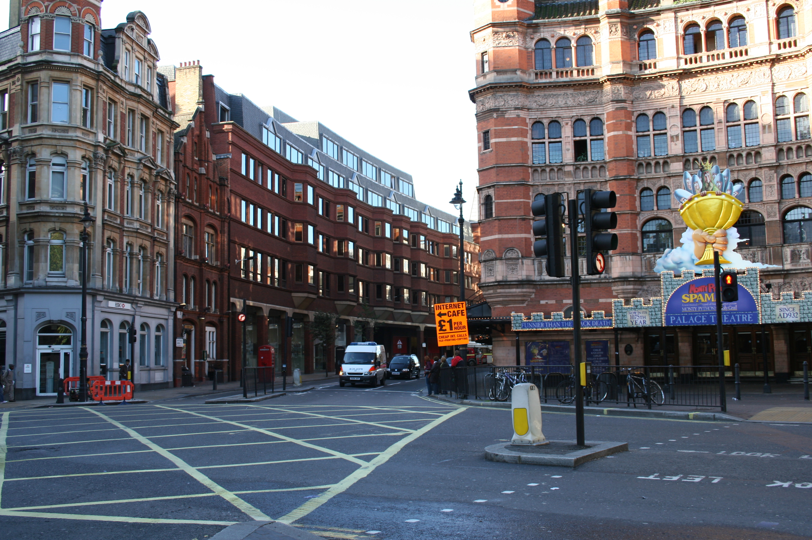

# Arranque. Toma de contacto.  

## Notas para los GMs  

La idea es que haya mucho contraste entre el PNJ y el GM para que la cuarta pared se medio mantenga.  

* Frank / Jaime: Poli bueno.  
* Señor Cabot / Pedro: Poli malo  

Que nos llevemos mal puede ayudar a que, si hace falta, los GMs se retiren a discutir el tema entre ellos o con sus superiores.  

## PNJs  

### Señor Cabot (Pedro)  

Personalidad:  
- Es todo un encanto: una mala mezcla entre J. Jonah Jameson y el Coronel Miles de Avatar.  
- Maleducado. No respeta a sus iguales, ¿cómo va a respetar a los PJs?  

### Frank (Jaime)  

Personalidad:  
- Mentor y cercano. Una especie de Charles Xavier.  
- Aguanta a Cabot por que no le quedan más cojones pero intenta que no sea evidente para los equipos de campo. Al fin y al cabo, son la cara de PRIS-13.  

## Briefing  

**Localización**  
Edificio posterior a la segunda guerra mundial en Cambridge Triangle, Londres.  

  

Os han convocado a las 08:30 en la sala de operaciones.  

Estáis esperando 10 minutos en la sala y,  

Señor Cabot:  
    > Señores, tenemos 2 misiones que tienen máxima prioridad. Desgraciadamente no podemos esperar a que tengáis vuestros cursos, meteros en misiones con ruedines o enseñaros dónde está la Puta cafetería.
    >
    > Vais a tener un bautismo con dos cojones y tened muy presente que vuestras cagadas pueden costaros la vida, costársela a vuestros compañeros o, lo que es peor, dañar a la agencia.
    >
    > Pero ya está bien de acunaros y de palabras bonitas. Vamos al tema. ¿Frank?

Frank:  
    > TODO: Dar una intro de la misión de la biblioteca.
    >

Señor Cabot:  
    > Está bien.
    >
    > Para los que sepan hacer algo más que buscar perritos perdidos, tenemos una misión de VERDAD:
    >
    > En el dosier pueden leer que François Dijon es el representante legal y testaferro de Taras Intercorp.
    >
    > Taras lleva tiempo en nuestro radar.
    >
    > Su nombre ha salido en numerosos tratos de tráfico de armas. Sospechamos que está detrás de ellas pero no tenemos más información.
    >
    > François, desde hace unos meses, va el último jueves de cada mes al casino de Monte Carlo (Mónaco) y juega a la ruleta.
    >
    > Sabemos que es un jugador consumado. Le gusta apostar fuerte y no le gusta perder; esa es nuestra puerta de entrada.
    >
    > Vuestro objetivo es fácil: conseguir el portátil de François Dijon.
    >
    > Nuestro análisis inicial indica que François suele dejar el maletín en la su habitación, pero no esperen que esté encima de la cama esperandoles, probablemente esté en la caja fuerte de su habitación.
    >
    > Si no son completamente incompetentes, espero que consigan el portátil e información sobre Taras Intercorp.
    >

Frank:  
    > Está bien, creo que es suficiente.
    >
    > ¿Alguien tiene alguna pregunta?  

En el momento que alguien pregunta, Cabot se levanta tranquilamente y se pira.  
