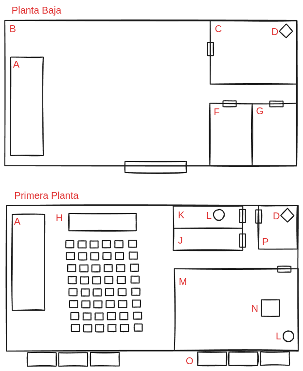

# Golpe al palacete

<!-- START doctoc generated TOC please keep comment here to allow auto update -->
<!-- DON'T EDIT THIS SECTION, INSTEAD RE-RUN doctoc TO UPDATE -->
**Table of Contents**  *generated with [DocToc](https://github.com/thlorenz/doctoc)*

- [Resumen](#resumen)
- [Objetivos de PRIS-13](#objetivos-de-pris-13)
- [Objetivos ocultos de PRIS-13](#objetivos-ocultos-de-pris-13)
- [Objetivos de Taras Intercorp](#objetivos-de-taras-intercorp)
- [Horario de la fiesta](#horario-de-la-fiesta)
- [El golpe](#el-golpe)
  - [Briefing](#briefing)
  - [18:00 Bienvenida, recepción y cóctel](#1800-bienvenida-recepci%C3%B3n-y-c%C3%B3ctel)
    - [Encuentro con Isabella Rossi y Lorenzo Moretti](#encuentro-con-isabella-rossi-y-lorenzo-moretti)
    - [Encuentros durante la bienvenida](#encuentros-durante-la-bienvenida)
  - [19:30 Concierto de piano y órgano](#1930-concierto-de-piano-y-%C3%B3rgano)
    - [Detalle del folleto del concierto](#detalle-del-folleto-del-concierto)
    - [Intento del golpe: Cosas comunes](#intento-del-golpe-cosas-comunes)
    - [Intento del golpe: El conducto de ventilacion desde el aseo de señoras](#intento-del-golpe-el-conducto-de-ventilacion-desde-el-aseo-de-se%C3%B1oras)
    - [Intento del golpe: Forzar la puerta de la sala de exposiciones](#intento-del-golpe-forzar-la-puerta-de-la-sala-de-exposiciones)
    - [Intento del golpe: Entrar a la sala de exposiciones por el balcon](#intento-del-golpe-entrar-a-la-sala-de-exposiciones-por-el-balcon)
    - [Eventos con el personal de seguridad](#eventos-con-el-personal-de-seguridad)
  - [21:30 Cena](#2130-cena)
  - [23:30 Exposición de reliquias cedidas por el Vaticano](#2330-exposici%C3%B3n-de-reliquias-cedidas-por-el-vaticano)
  - [Conclusion](#conclusion)
- [Mapas](#mapas)
  - [El palacete](#el-palacete)
- [NPCs](#npcs)
  - [Isabella Rossi y Lorenzo Moretti](#isabella-rossi-y-lorenzo-moretti)
  - [John Tong Hon](#john-tong-hon)
  - [François Dijon](#fran%C3%A7ois-dijon)
  - [Habilidades de François Dijon](#habilidades-de-fran%C3%A7ois-dijon)
  - [Smith (Guardaespaldas de François Dijon)](#smith-guardaespaldas-de-fran%C3%A7ois-dijon)
  - [Wilson (Guardaespaldas de François Dijon)](#wilson-guardaespaldas-de-fran%C3%A7ois-dijon)
  - [Habilidades de Smith & Wilson](#habilidades-de-smith--wilson)

<!-- END doctoc generated TOC please keep comment here to allow auto update -->

## Resumen

Después del encuentro en el casino, **PRIS-13** se ha percatado del interés que tiene **Taras Intercorp** por conseguir el **Fénix de Jade**, cosa que les llama mucho la atención.

Gracias a la información obtenida en (el casino / la biblioteca) **PRIS-13** sabe que el **Fénix de Jade** se encuentra en el vaticano fuertemente custodiada y que si quiere averiguar porque tiene tanto interes **Taras Intercorp** en el, tendrá que poder estudiarlo desde mas cerca.

**PRIS-13** decide que lo mas sencillo será hacerse con la reliquia, dando el cambiazo con una replica de la misma y aunque durante semanas preparan el golpe en el vaticano surge un contratiempo: La reliquia va a ser expuesta en un palacete con motivo del 85 cumpleaños del obispo **John Tong Hon**.

Gracias a las conexiones que tiene **PRIS-13**, ha conseguido cuatro invitaciones para el evento y cuatro pases de servicio, y dejara en mano de los lideres de los grupos tácticos, la elección de distribuirlos a su antojo

## Objetivos de PRIS-13

* Conseguir dar el cambiazo a la reliquia durante la exposición.

## Objetivos ocultos de PRIS-13

Conseguir al menos uno de los siguientes:

* Evitar completamente la destrucción de la presa.
* Conseguir escapar antes de que el pueblo sea destruida por la inundación de la presa.

## Objetivos de Taras Intercorp

Taras Intercorp se encuentra en las inmediaciones para evitar que la agencia consiga su objetivo, el motivo puede ser alguno de estos dos:

* Después del encuentro con la agencia en (el casino / la biblioteca), quieren asegurarse que la reliquia se encuentra en la exposición y que la agencia no se hace con ella
* Hay un topo dentro de la agencia (igual esto puede dar un giro al final cuando se muestre como es y puede servirnos de apoyo para explicar cabos sueltos)

## Horario de la fiesta

* 18:00 Bienvenida, recepción y cóctel
* 19:00 Concierto de piano y órgano
* 21:30 Cena
* 23:30 Exposición de reliquias cedidas por el Vaticano

## El golpe

### Briefing

El plan es sencillo, acceder a la sala, dar el cambiazo y salir pitando sin que nadie se entere.

El mejor momento que consideran nuestros analistas para dar el golpe es durante el concierto, desde la sala de conciertos se puede tener una panoramica de algunos de los puntos de entrada.

Aunque los agentes son libres de elegir, nuestros analistas recomiendan los siguientes puntos de entrada:

* La puerta principal de la sala de exposiciones
* El conducto de ventilacion desde el aseo de señoras
* El balcon exterior de la sala accediendo desde el tejado del palacete a traves de un montacargas y descolgandose hasta el mismo

Con tan poco tiempo no hemos podido saber con certeza total la seguridad del palacete, aunque es presumible que tengan algun sistema de vigilancia, alarma y personal de seguridad.

**Briefing para PJs:**

**Breaking news:** El grupo ecoterrorista _Prestamo De Nuestros Hijos_ está muy activo en las redes sociales y ha convocado una movilización al día siguiente. Prometen que van a mandar un mensaje claro a las corporaciones y los corruptos gobernantes de Arnsberg.  

**Calbot:**
> Agentes, escuchen bien. Hemos descubierto un momento propicio para poder hacernos con **el fenix de jade**, durante la celebracion del cumpleaños que van a hacer como homenaje a el Obispo **John Tong Hon** en Arnsberg el proximo sabado... Frank..."
> 

**Frank:**
> El evento se llevará a cabo en un palacete del siglo XVII, ubicado en la población de Arnsberg, Alemania. El plan es sencillo: acceden a la sala, hacen el cambiazo con una replica y salen pitando sin que nadie se entere.
>
> Nuestros analistas han determinado que el mejor momento para dar el golpe es durante el concierto de piano y organo que se dara en el evento a las 19:30.

**Calbot:**
> Hemos conseguido 4 invitaciones para el evento y 4 pases de servicio como camareros que pueden repartir como prefieran. 
> 
> Aunque tienen libertad para elegir el punto de entrada, nuestros analistas recomiendan tres opciones principales: la puerta principal de la sala de exposiciones, el conducto de ventilación desde el aseo de señoras y el balcón exterior de la sala, accediendo desde el tejado del palacete a través de un montacargas y descolgándose hasta el mismo."

**Frank:**
> Con tan poco tiempo, no hemos podido confirmar todos los detalles de la seguridad del palacete, pero es razonable asumir que cuentan con algún sistema de vigilancia, alarma y personal de seguridad. Actúen con cautela y precisión. Buena suerte.

**GMs : Estructura / Resumen:**

* Accesos:
    * La puerta principal de la sala de exposiciones
    * El conducto de ventilacion desde el aseo de señoras
    * El balcon exterior de la sala

### 18:00 Bienvenida, recepción y cóctel

Llegáis a las puertas de los jardines del palacete, estos son un despliegue de elegancia y naturaleza, reflejando el estatus de sus dueños. Al cruzar el umbral, un sendero de adoquines con algunos arcos salteado por enredaderas de hiedra y flores trepadoras daba la bienvenida. Setos de boj perfectamente recortados formaban laberintos geométricos, guiando a los visitantes a través de diversas secciones.

En el centro, un parterre lleno de hierbas aromáticas como lavanda y romero inundaba el aire con fragancias embriagadoras rodeando una fuente de mármol esculpida con figuras mitológicas.

Adicionalmente, han añadido antorchas y lámparas de aceite para dar una ambientación mas cálida y personal, que en ese momento se encuentra el personal de servicio encendiendo.

También se pueden ver como van llegando algunos invitados engalanados para la ocasión acercándose a la puerta del palacio. Junto a unos setos, dos jóvenes que notáis desentonan con el resto de la decoración, se encuentran fumando y controlando a los invitados según van llegando.

#### Encuentro con Isabella Rossi y Lorenzo Moretti

Junto a unos setos, se encontraran con **Isabella Rossi** y **Lorenzo Moretti** en lo que parece que están haciendo una labor pésima de vigilancia, fumando un cigarro, hablando y lanzando miradas furtivas a los invitados como queriendo hacer un catalogo de todos ellos.

Si los personajes lo creen conveniente, se pueden acercar a una distancia prudente (`Exito basico con +1 en Stealth`) y escuchar lo que dicen sin levantar sospechas, el dialogo sera algo así:

> -Un par de trabajitos mas como este y despues la gran vida, ya lo verás Lorenzo.
> -Que es lo que tenemos que hacer exactamente Isa?
> -Revisar que no se llevan el colgante hasta que pase... bueno, ya sabes.
> -Uff.... hasta que hora tenemos? No quiero que nos pase nada, a fin de cuentas muertos no vamos a poder darnos la gran vida.
> -Hasta las 11, despues hay que salir pitando.
> -Bueno, terminamos el cigarro y nos integramos un poco con estos estirados... ¿no?

**Observaciones:**

Isabella y Lorenzo son esclavos de vampiros, y Taras Intercorp, los ha encomendado vigilar que el Fénix no desaparezca antes de las 11 de la noche.

Esto es lo que saben ellos, a las 11 se va a volar la presa, pero esto no es cierto, realmente la presa va a ser destruida sobre las 10 (Vampiros que tienen poco aprecio por sus esclavos humanos... C'est la vi)

Si los héroes son descubiertos, o si deciden enfrentarse a ellos, se rendirán a la mínima y les contaran lo que saben a cambio que les dejen con vida. (Esto sera verdad y se puede comprobar fácilmente si alguno de los héroes tiene la feature `LIE TO ME` o realizando una tirada de `exito basico con FOCUS / Detect` )

Una vez conseguido esto, los héroes tendrán que dividir el grupo en 2, una parte del grupo tendrá que realizar una incursión a la presa para evitar que ocurra esto y la otra parte, se dará toda la prisa posible para dar el cambiazo con la reliquia

**DIVISION (Parte completada despues de que eligieran los personajes):**

* Equipo Presa:
    * Olga
    * David
    * Palomo
    * Angie
* Equipo Fiesta:
    * Angelica
    * Pau
    * Zoe
    * Estrella

#### Encuentros durante la bienvenida

Hay camareros llevando bandejas con comidas y bebidas a lo largo de la sala principal y algunos corrillos con celebridades locales y amigos del obispo.

**Para los GMs**:

Dentro de la fiesta solo hay celebridades locales y amigos del obispo, con poca o ninguna relación con los intereses de los héroes, a excepción del obispo o camelarse al personal de seguridad para que le cuente cosas.

Los invitados deberian integrarse mientras investigan y hablan con los invitados (para disimular)

Los PJs encargados del servicio, deberian hacer las tareas que les encomienden aunque pueden excaquearse les llamaran la atencion cada cierto tiempo

**Roles de invitados**:

* **CRITICAL** con `SMOOTH + STYLE` se le acerca el obispo y se pone a hablar con ellos

**Roles de servicio**:

* **CRITICAL** con `FOCUS + DETECT | CRIME + STREETWISE` descubren el montacargas

**Ambos roles**:
* `FOCUS + DETECT | CRIME + STREETWISE`
    * `BASIC`, ven las camaras de seguridad pobremente camufladas
    * `CRITICAL ó SUP`, se fijan que en las ventanas hay un sistema de alarma

### 19:30 Concierto de piano y órgano

Según se acercan las 19:15, el servicio va llamando a los invitados para que acudan a la sala de conciertes del palacete donde están ya preparados unos lujoso piano de cola y un órgano con pinta antigua pero muy bien conservado que seguramente lleve varias generaciones con los dueños del palacete.

Los personajes con la acreditación de invitados se acercaran y tomaran sus asientos y a las 19:30 empezara el concierto

**Observaciones:**

Este es posible uno de los mejores momentos para no llamar demasiado la atención y tratar de infiltrarse en la sala de exposiciones ya que estarán todos los invitados en esta sala y la gran mayoría del servicio preparando la cena y el gran salón para la misma.

Cada vez que los héroes hagan cualquier tipo de sonido durante el concierto, recibirán un chistido por algunos de los invitados, el numero de invitados que chisten y las miradas inquisitoriales se irán incrementando con el numero de interrupciones que realicen.

* **Primer chistido** (Le miran un par de personas, sin ningún tipo de efecto)
* **Segundo chistido** (Le miran media docena de personas)mantenimiento
* **Tercer chistido** (La gente les increpa con susurros: *disculpe... le importaria?*)

#### Detalle del folleto del concierto

[Lista en spotify](https://open.spotify.com/playlist/6pVwRqCSjYKEXCDnfUrQoI?si=74ebed855ca84ce7)

* Ludwig van Beethoven
    - "Sonata No. 14 in C-sharp minor, Op. 27 No. 2 'Moonlight'" (15 minutos)
* Frédéric Chopin
    - "Nocturne in C minor, Op. 48 No. 1" (7 minutos)
    - "Ballade No. 1 in G minor, Op. 23" (10 minutos)
* Franz Liszt
    - "Totentanz" (Dance of Death) (15 minutos)
    - "Funérailles" (10 minutos)
* Wolfgang Amadeus Mozart
    - "Piano Sonata No. 11 in A major, K. 331 'Rondo alla Turca'" (15 minutos)
* Johann Sebastian Bach
    - "Toccata and Fugue in D minor, BWV 565" (8 minutos)
* Sergei Rachmaninoff
    - "Prelude in C-sharp minor, Op. 3 No. 2" (4 minutos)
    - "The Isle of the Dead, Op. 29" (20 minutos)
* Claude Debussy
    - "Clair de Lune" from "Suite bergamasque" (5 minutos)
    - "La cathédrale engloutie" from "Préludes, Book 1" (6 minutos)
* Franz Schubert
    - "Impromptu in G-flat major, Op. 90 No. 3" (6 minutos)
    - "Der Erlkönig" (transcription by Franz Liszt) (5 minutos)
* Pyotr Ilyich Tchaikovsky
    - "The Seasons, Op. 37a" (selected pieces) (15 minutos)
* Alexander Scriabin
    - "Étude in D-sharp minor, Op. 8 No. 12" (2 minutos)
* Maurice Ravel
    - "Gaspard de la nuit" (Ondine, Le Gibet, Scarbo) (22 minutos)
* Erik Satie
    - "Gnossienne No. 1" (4 minutos)

#### Intento del golpe: Cosas comunes

Cada vez que alguien haga una tirada, si hay PJs de invitado entre el publico, les tienes que comunicar que el de seguridad va hacia la zona donde se encuentran los otros PJs y tiene que decidir que hacer

#### Intento del golpe: El conducto de ventilacion desde el aseo de señoras

Tienen que sortear los siguientes problemas para resolver satisfactoriamente y poder salir airosos

* Problema 1: Se encontraran a gente y se tendran que librar de ellos
    * Una facil, un señor se equivoca (es señor...). Lo mas facil es indicarle que se trata del servicio de señoras (si se acuerdan los PJs y los PJs dentro son femenino)
* Problema 2: Tienen que escalar, tirada de `BRAWN + STUNT`
    * Si tienen ayuda de otro PJ obtienen +1 en la tirada
    * `FAIL` Hace mucho ruido y se dispara **Evento grave del personal de seguridad**
    * `BASIC` Hace un poco de ruido y se dispara **Evento leve del personal de seguridad**
    * `CRITICAL ó +` Exito
* Problema 3: Tienen que tener mucho cuidado para no hacer ruido, hacer 3 tiradas de `NERVES + COOL | SMOOTH + STYLE | CRIME + STEALTH`
    * `FAIL` Hace mucho ruido y se dispara **Evento grave del personal de seguridad**
    * `BASIC` Hace un poco de ruido y se dispara **Evento leve del personal de seguridad**
    * `CRITICAL` Exito
    * `EXTREME ó +` termina esta fase (no hace falta hacer mas tiradas)
* Problema 4: Salir en la sala sin hacer ruido `NERVES + COOL | SMOOTH + STYLE | CRIME + STEALTH`
    * `FAIL` Hace mucho ruido y se dispara **Evento grave del personal de seguridad**
    * `BASIC` Hace un poco de ruido y se dispara **Evento leve del personal de seguridad**
    * `CRITICAL ó +` Exito

#### Intento del golpe: Forzar la puerta de la sala de exposiciones

Tienen que sortear los siguientes problemas para resolver satisfactoriamente y poder salir airosos

* Problema 1: Hay personal de seguridad patruyando (solo un agente)
    * Cada 5 minutos se acerca a la puerta
* Problema 2: Hay una camara apuntando a la puerta
    * Aunque no tiene efecto la camara, no hay nadie vigilando las mismas, la grabacion llegara a manos de **El Señor Cabot** que echara una bronca a los PJs
* Problema 3: La puerta esta cerrada y hay que forzarla, hacer 3 tiradas de `NERVES + COOL | SMOOTH + STYLE | CRIME + STEALTH`
    * `FAIL` Les ven forzando la puerta... ¿como pueden explicar esto? **Evento critico del personal de seguridad**
    * `BASIC` El de seguridad les ve, aunque no esta convencido de que ha pasado se dispara **Evento moderado del personal de seguridad**
    * `CRITICAL` Exito
    * `EXTREME ó +` termina de abrir (no hace falta hacer mas tiradas)

Tienen que sortear los siguientes problemas para resolver satisfactoriamente y poder salir airosos

#### Intento del golpe: Entrar a la sala de exposiciones por el balcon

* Problema 1: Hay que llegar al montacargas
    * Hay dos formas de acceder al montacargas (ver mapa del palacete)
    * En las cocinas (C) (siempre hay gente trabajando y se me antoja muy dificil que los PJs puedan justificar su acceso por aqui, pero que lo intenten a ver que sale)
    * En la sala del servicio (P). Esta sala esta cerrada con llave, asi que tienen dos opciones:
        * Pueden conseguir la llave si hablan con el personal sabran que la tiene el Chef que se encuentra en la cocina. Para que el Chef les de la llave pueden:
            * Robarla al chef, esta muy ocupado por lo que es facil: **BASIC** `CRIME + STEALTH`
            * Haberla conseguido antes hablando con el chef intentandoselo camelar, como me imagino al Chef de South Park, cualquier personaje femenino que lo intente tiene un +1: `SMOOTH + (FLIRT | LEADERSHIP | SPEECH | STYLE)`
                * `FAIL` No te lo crees ni tu... por cierto... ¿quien decias que te habia contratado? **Evento critico del personal de seguridad**
                * `BASIC` Estoy muy ocupado, por favor vete a tu puesto lo antes posible
                * `CRITICAL` Exito
* Problema 2: Hay camaras de seguridad exteriores patruyando
    * Aunque no tiene efecto la camara, no hay nadie vigilando las mismas, la grabacion llegara a manos de **El Señor Cabot** que echara una bronca a los PJs
* Problema 3: Tienen que desconectar la alarma, hacer 1 tirada `CRIME + STEALTH`
    * Cualquier resultado que no sea `CRITICAL` dispara el **Evento critico del personal de seguridad**
    * `CRITICAL` Exito
* Problema 4: Tienen que forzar la cerradura aunque esta es facil, hacer 1 tirada de `NERVES + COOL | SMOOTH + STYLE | CRIME + STEALTH`
    * `FAIL` Les ven forzando la puerta... ¿como pueden explicar esto? **Evento critico del personal de seguridad**
    * `BASIC` El de seguridad les ve, aunque no esta convencido de que ha pasado se dispara **Evento moderado del personal de seguridad**
    * `CRITICAL` Exito
    * `EXTREME ó +` termina de abrir (no hace falta hacer mas tiradas)

#### Eventos con el personal de seguridad

**Evento leve del personal de seguridad:**

Hace ruido, el de seguridad se mosquea, mira a todos los lados, le pregunta a la persona que tenga mas cerca (si hay un PJ cerca sera a este)

**Evento moderado del personal de seguridad:**

El de seguridad sospecha un poco del PJ que ha visto haciendo algo (aunque no esta seguro). Se tiene que librar con el de alguna forma roleando

**Evento grave del personal de seguridad:**

El de seguridad sospecha, al cabo de 5 minutos llamara a otros de seguridad e investigaran. Los heroes tienen 5 minutos para terminar la faena o se liara una buena

**Evento critico del personal de seguridad:**

El de seguridad les ha pillado, llamara a otros de seguridad y les apuntara con un taser. 

Los heroes tienen 5 minutos para terminar la faena antes de que vengan refuerzos.

### 21:30 Cena

Terminado el concierto, en la sala principal han montado las mesas para hacer la cena, durante este momento pueden volver a intentar el golpe

### 23:30 Exposición de reliquias cedidas por el Vaticano

Llegados a este punto los personajes ya deberían haberse hecho con el Fénix.

### Conclusion

Una vez tengan el fenix, y lleguen al parking, si el equipo de la presa ha tenido exito, nos encontraremos con **François Dijon** que ha llegado con 2 guarda espaladas y que ha descubierto las intenciones de los heroes.

Les pedira el Fenix y si no hacen caso empezara un combate

## Mapas

### El palacete

**Leyenda:**

* A. Escaleras (comunica el bajo con la primera planta)
* B. Salon principal (bienvenida)
* C. Cocinas
* D. Monta cargas (comunica el bajo con la primera planta y el tejado)
* E. **Se me olvido usar la letra E :P**
* F. Aseos de caballeros
* G. Aseos de señoras
* H. Sala de conciertos
* J. Aseo de caballeros
* K. Aseo de señoras
* L. Conducto de ventilacion (comunica con varias salas, entre ellas con la sala de exposiciones)
* M. Sala de exposiciones
* N. El fenix de jade
* O. Balcones
* P. Sala de servicio (escobas y demas)

## NPCs

### Isabella Rossi y Lorenzo Moretti

Son estudiantes universitarios que conocieron (durante unas practicas) la naturaleza vampírica de **Taras Intercorp**. Isabella, seducida por la inmortalidad, se puso a trabajar para ellos.

Lorenzo quiere ser el novio de Isabella, pero esta no esta interesada mas que en tener amistad con el.

Ambos son extremadamente fáciles de persuadir y cederán al primer problema contando a los héroes todo lo que saben de Taras, que es lo siguiente:

* Hay vampiros dentro del holding
* Las intenciones de volar la presa

* Atributos: 1
* Features: **irrelevante**

### John Tong Hon

John Tong Hon (Hong Kong, 31 de julio de 1939) es un cardenal chino, obispo emérito de Hong Kong. John Tong Hon. Obispo de Hong Kong.

Es un anciano muy calmado y durante la fiesta estará siempre hablando con alguno de los invitados.

Si a los jugadores se les ocurre investigar a **John Tong Hon**, se darán cuenta que paso varios años estudiando algunas de las reliquias en el vaticano ya que parte de su labor allí era la de conservador e historiador de las mismas.

Conoce exactamente lo que dicen los libros sobre la reliquia y aunque no cree en ellas, si los jugadores le preguntan les contara sin problemas lo que sabe:

> Hace muchos siglos, en un reino lejano, vivía un sabio anciano conocido por su profunda conexión con el espíritu del Fénix. Este ser mítico, renacido de sus propias cenizas, era símbolo de eternidad y protección. Una noche, el anciano tuvo una visión en la que el Fénix le revelaba un terrible peligro: los demonios nocturnos planeaban invadir el reino, trayendo consigo oscuridad y desesperación.
>
> Para proteger a su pueblo, el anciano forjó un colgante especial a partir de un jade puro, una piedra considerada sagrada por su conexión con el mundo espiritual. Trabajó incansablemente, infundiendo el colgante con la esencia del Fénix, y le dio la forma de esta ave majestuosa. Al terminar, el Fénix de Jade resplandecía con una luz suave y cálida, emanando una energía protectora.
>
> Se dijo que aquel que llevara el Fénix de Jade no solo estaría protegido de los demonios nocturnos, sino que también tendría el valor y la fuerza del Fénix para enfrentar cualquier adversidad. Con el tiempo, el colgante se convirtió en una reliquia preciada, pasada de generación en generación, siempre vigilando y protegiendo a su portador de las sombras que acechaban en la noche.
>
> Así, el Fénix de Jade sigue siendo un símbolo de esperanza y protección, recordándonos que incluso en los momentos más oscuros, la luz y la fuerza del espíritu siempre prevalecerán.

### François Dijon

- Es un representante / abogado de Taras Intercorp.  
- Le gusta apostar fuerte y no le gusta perder.  
- Taras Intercorp es una tapadera para el tráfico de armas.  

- **ATTACK**: CRITICAL
- **DEFENSE**: CRITICAL
- **GRIT**: `[ ]-[ ]-[ ]-< >-[ ]-[ ]-[ ]-< >-[ ]`

### Habilidades de François Dijon

**NOSFERATU**
* (MIDNIGHT WARS, MONSTROUS FEATS, VAMPIRES ONLY)
* You are a child of the night, born again with a thirst for blood.
* Gain a Free Re-roll to all Nerves rolls. When you feed on human blood, you may heal from one Condition of any kind.
* Weakness: You suffer -1 to all rolls made against Anti-vampire guns.
* If you are exposed to sunlight, you cannot call on your Monstrous Feats and look Tired. If you do not return to the shadows on the next turn, you become Nervous, then Hurt, then Broken. From the fifth turn onward, you must take a spin on the Death Roulette every turn.

**BITE**
* (MIDNIGHT WARS, MONSTROUS FEATS, Cost ⚡)
* You plunge your fangs in your victim to feast on their blood or their pain.
* After landing a blow on an enemy in Melee or Close Range, you may spend 1 Adrenaline to bite them and recover 3 Grit.

**DARK INSTINCT**
* (MIDNIGHT WARS, MONSTROUS FEATS)
* Your sharp senses allow you to hear everything and see through lies.
* Gain a Free Re-roll to preempt dangers or ambushes, to locate lurking enemies, or to recognize lies
* (⚡) Repeat a failed Awareness or Detect roll.

### Smith (Guardaespaldas de François Dijon)

Un ghoul guarda-espaldas

- **ATTACK**: CRITICAL
- **DEFENSE**: 2-BASIC
- **GRIT**: `[ ]-[ ]-[ ]-< >-[ ]-[ ]-[ ]-< >-[ ]`

### Wilson (Guardaespaldas de François Dijon)

Un ghoul guarda-espaldas

- **ATTACK**: CRITICAL
- **DEFENSE**: 2-BASIC
- **GRIT**: `[ ]-[ ]-[ ]-< >-[ ]-[ ]-[ ]-< >-[ ]`

### Habilidades de Smith & Wilson

**AUTOMATIC WEAPONS**
* (ENEMY FEATS, 1 FP)
* The Enemies are armed with tommy guns or similar automatic weapons.
* Heroes who fail to score at least a Basic Success during their Reaction Turn become Nervous. If they are already Nervous, they lose 1 additional Grit.

**NOSFERATU**
* (MIDNIGHT WARS, MONSTROUS FEATS, VAMPIRES ONLY)
* You are a child of the night, born again with a thirst for blood.
* Gain a Free Re-roll to all Nerves rolls. When you feed on human blood, you may heal from one Condition of any kind.
* Weakness: You suffer -1 to all rolls made against Anti-vampire guns.
* If you are exposed to sunlight, you cannot call on your Monstrous Feats and look Tired. If you do not return to the shadows on the next turn, you become Nervous, then Hurt, then Broken. From the fifth turn onward, you must take a spin on the Death Roulette every turn.

