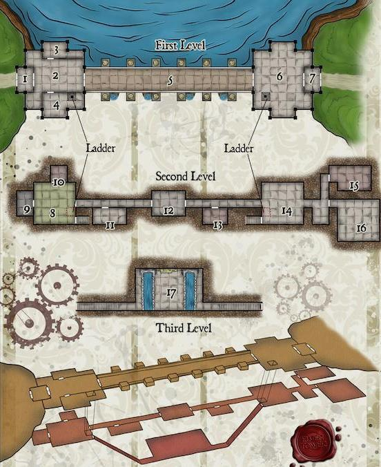

# Presa
  

## Objetivo

Infiltración y desactivar los explosivos.  

**Oculto. Opcional** Revisar los papeles en la sala 17. Encontrarán papeles incriminando al grupo ecoterrorista Prestamo de Nuestros Hijos.

## Plan de Taras Intercorp.  

Objetivos:  
 - Volar la presa para que inunde el palacete donde se encuentra la reliquia El Fénix de Jade.  
 - Incriminarán al grupo ecoterrorista Préstamo de Nuestros Hijos.

Tienen a un buen grupo de ex-trabajadores controlados mentalmente.  
Pedro y Max están al cargo. Están revisando que todo está listo y preparado para hacer volar la presa mañana.
En la sala hay un

## Timeline  

### Los PJs se acercan en coche a la presa.  

El acceso está cortado. Hay múltiples pintadas del grupo Préstamo de Nuestros Hijos y la caseta está destrozada.  
Los PJs tienen que dejar los coche ahí y seguir a pie.  

### Dejan los coches.
El camino está rodeado de un bosque espeso.  
De vez en cuando oye un río que pasa cerca. En los ocasionales claros ven una presa a un par de kilómetros.  
Aullido de lobo en la lejanía.  

Todos los PJs van vestidos de negro con un kit de incursiones básico: machete, pistola de bajo calibre con silenciador (2 usos por silenciador).  

En el bosque hay varios caminos para llegar:  
- Un camino directo que va por la carretera, pero los PJs son más visibles.  
- Un camino que va por la parte superior de la presa. Es más indirecto y menos visible, pero no saben qué tipo de accesos habrá o no.  

### Hit&Run de un lobo.  

Un enorme lobo gris controlado mentalmente por el vampiro intentará atacar a un jugador que se quede sólo o que  esté más apartado o retrasado.  
Un ataque y se va.  
Tiene un collar con el que le controlan los Ghouls.  

El objetivo del lobo es alejarles de la presa.  

### Encuentro con Jan.  
Los PJs encuentran al chaval.  
Quizá un PJ huele a humo o a alubias cocinadas y encuentran su tienda de acampada.  
Pueden seguir sus huellas tranquilamente y dar con él.  

Les cuenta que está preocupado por su padre. Hace dos días se fue al trabajo y no ha vuelto. No consigue contactar con él.  
Al acercarse a la presa vio que algo no iba bien. Los guardias de la garita que hay al lado de la presa no hablan y le dispararon al acercarse.  
Parece que han sellado las puertas.   
Jan ha trabajado algunos veranos en la presa y conoce las instalaciones.  

### Llegan a la entrada del edificio de la presa.  

**Opción 1**. Incursión por la puerta principal:  
Al lado del edificio hay una caseta con 2 guardias vigilando.  
Hay cámaras de seguridad normales (que nadie está mirando, pero eso no lo saben los PJs).  

**Opción 2**. Infiltrarse por el almacén y, desde ahí por los tubos de ventilación.

### Incursión en el edificio.

**Entrada por el almacén. Sala 15.**  
La pueden encontrar:  
  - Si **Jan** está con ellos, se lo puede decir.
  - Si deciden investigar en los alrededores `éxito básico en FOCUS+DETECT`.

Descripción:
  - Sala amplia de unos 200 metros llena de cajas con recambios, maquinaria (un toro, un traspalé, etc.) y una mesa con un monitor.
  - Hay lo que parecen unos tubos de refrigeración (accesible desde una escotilla que da al tejado).

Tubos de refrigeración:
 - Sólo caben los PJs más pequeños.
 - Baja directamente 2 plantas (tiene unas protuberancias a modo de agarre).
 - Terminan en una sección enrejada (parece que para las ratas) en la sala de mando donde están los Ghouls.  

**Entrada principal. Sala 8.**  
Hay 7 trabajadores parapetados. Están hipnotizados y tienen poco aprecio por su vida.  
Trabajadores:  
  - Un hombre de 50 y pico años con traje y corbata. Administrador de almacenes (**con rifle de caza**).  
      - Es el padre de **Jan**. Si está **Jan**, le reconocerá  
      - Los PJs pueden intentar retener a **Jan** con un `éxito extremo de Nerves+Awareness`  
  - Una mujer en traje de unos 40 años. Oficial de compras (**con una llave grifa grande**)  
  - 1 hombre viejo con traje raído. Bedel (**con rifle de caza**)  
  - 3 hombres y 1 mujer en forma con mono sucio de grasa. Maquinistas y operarios.  
      - 1 hombre y la mujer tienen **escopeta de caza**.  
      - 2 hombres tienen unas **barras de acero**.
Hombre lobo (está cerca):
  - Si hay tiros, ataca y se pira.

Todos están en posición de vigilancia atrincherados (no es un comportamiento normal estar atrincherados sin relajarse, pero están siendo controlados mentalmente).  

**Tercer nivel. Sala 17.**
En la segunda sala están los 2 Ghouls, Max y Pedro.  
Están demasiado ocupados discutiendo de cómo hay que hacer las cosas para detectar una posible incursión sigilosa salvo que algo les llame la atención de forma clara.  
Max se está quejando de que tiene hambre y que lleva 3 días sin comer. Pedro le dice que coma algo, pero Max dice que pasa, no le gusta la comida alemana.  
Max o Pedro harán explotar la primera carga en el momento de que se percaten de que hay jaleo.

*Opcional* Si los PJs consiguen escuchar a los Ghouls, pueden enterarse de por qué quieren volar la presa y saber más sobre la reliquia.  

  > Max: Estoy hasta los huevos. ¿De verdad tenemos que volar una puta presa para acabar con una baratija?
  >
  > Pedro: ¿Y qué harías tú, listillo? Si tienes alguna idea brillante (sería la primera vez), ¿Por qué no se lo dices a François? O, mejor, ¿por qué no llamas al puto Kuzma y le dice que vas a solucionarle todos los problemas?
  >
  > Max: Joder, tío, no te pases, sólo digo que podríamos prender fuego al puto edificio y listo.
  >
  > Pedro: Sí, claro, seguro que no levantamos sospechas prendiendo un palacete en mitad del pueblo. ¿Tú eres gilipollas o qué?
  >
  > Max: Vale, vale, sólo lo decía por que me parece un poco bestia cargarse un pueblo para eliminar una estatuilla de mierda...
  >

### Combate final.

Los PJs contra el hombre lobo y los Ghouls.  

**Opcional**:
  - Alguno de los PJs puede detectar que el lobo tiene un collar extraño.  
      - Si rompen el collar, liberarán al hombre lobo y éste puede matar a los Ghouls.
      - Si salvan al hombre lobo, éste se presentará a ellos. Le debe un favor a quien le haya liberado.
  - Si revisan la sala 17 encontrarán papeles incriminando al grupo ecoterrorista Préstamo de Nuestros Hijos.
