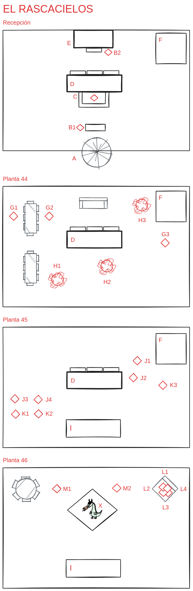

# Equipo de asalto

<!-- START doctoc generated TOC please keep comment here to allow auto update -->
<!-- DON'T EDIT THIS SECTION, INSTEAD RE-RUN doctoc TO UPDATE -->
**Table of Contents**  *generated with [DocToc](https://github.com/thlorenz/doctoc)*

- [Consideraciones](#consideraciones)
- [Descripcion del edificio](#descripcion-del-edificio)
- [Planta 0](#planta-0)
- [Planta 1-43](#planta-1-43)
- [Planta 44](#planta-44)
- [Planta 45](#planta-45)
- [Planta 46](#planta-46)
- [Eventos Críticos](#eventos-cr%C3%ADticos)
  - [Evento critico de alarma](#evento-critico-de-alarma)
- [PNJs](#pnjs)
  - [Recepcion](#recepcion)
    - [C, Personal de recepcion (humano)](#c-personal-de-recepcion-humano)
    - [B1, Personal de Seguridad 1 (Ghoul)](#b1-personal-de-seguridad-1-ghoul)
    - [B2, Personal de Seguridad 2 (Ghoul)](#b2-personal-de-seguridad-2-ghoul)
    - [Coberturas (Para enemigos)](#coberturas-para-enemigos)
  - [Planta 44](#planta-44-1)
    - [H1, H2, H3, Carne de cañon](#h1-h2-h3-carne-de-ca%C3%B1on)
    - [G1, G2, G3, Lugartenientes Vampiros](#g1-g2-g3-lugartenientes-vampiros)
    - [G1, G2, G3, Habilidades de Lugartenientes Vampiros](#g1-g2-g3-habilidades-de-lugartenientes-vampiros)
  - [Planta 45](#planta-45-1)
    - [J1, J2, J3, Equipo Elite de seguridad](#j1-j2-j3-equipo-elite-de-seguridad)
    - [K1, K2, K3, Lugartenientes Vampiros (melee)](#k1-k2-k3-lugartenientes-vampiros-melee)
    - [K1, K2, K3, Habilidades de Lugartenientes Vampiros](#k1-k2-k3-habilidades-de-lugartenientes-vampiros)
    - [Atsumi Kia](#atsumi-kia)
    - [Habilidades de Atsumi Kia](#habilidades-de-atsumi-kia)
  - [Planta 46](#planta-46-1)
    - [M1, M2, Hombres lobo](#m1-m2-hombres-lobo)
    - [M1, M2, Habilidades de Hombres lobo elite](#m1-m2-habilidades-de-hombres-lobo-elite)
    - [L, Concubines](#l-concubines)
    - [L, Habilidades de Concubines](#l-habilidades-de-concubines)
    - [X, Helmut Neumeyer (aka Kuzma El Empalador)](#x-helmut-neumeyer-aka-kuzma-el-empalador)
    - [X, Habilidades de Helmut Neumeyer](#x-habilidades-de-helmut-neumeyer)
- [Mapa](#mapa)
- [Equipo](#equipo)
- [Resumen de combate del 23 de julio de 2024, como se cargaron a Kuzma en un turno](#resumen-de-combate-del-23-de-julio-de-2024-como-se-cargaron-a-kuzma-en-un-turno)

<!-- END doctoc generated TOC please keep comment here to allow auto update -->

## Consideraciones

* La idea original es rollo SWAT
* Dejar a los PJs decidir como proceder
* En un principio deberia ser algo asi:
    * **Muy importante:** Esperar en un furgon a que el equipo de mantenimiento desactive comunicaciones internas
    * Entrar en plan *The Matrix*
        * Cada X turnos evento de refuerzos (Ver mas adelante)
    * Ir subiendo:
        * Del tiron si el equipo de mantenimiento apaño los ascensores
        * Hasta la planta 44 si el equipo de mantenimiento NO apaño los ascensores

## Descripcion del edificio

* Edificio acristalado
* Cristales bastante opacos de visibilidad (transparente pero oscuros)
* Si se destruye uno de los cristales (Dificultad: `2-CRITICAL`) deja pasar la luz a un area de 5-10 metros

## Planta 0

* Los PJs tienen que entrar a saco
* **A**, La puerta giratoria 
    * Solo permite el paso de 2 en 2
    * Pueden volarla con una granada y entonces podran entrar los 4 a la vez
        * Esto se les tiene que ocurrir a los PJs, si hacen esto, pillaran por sorpresa al personal del piso y podran hacer 1 accion con +1 los 4 (piece of cake)
* Segun pasen de la puerta
    * El de seguridad les empezara a disparar
    * El de recepcion gastara reaction para llamar refuerzos
        * **Ventaja: Si las comunicaciones internas no funcionan, NO PODRA LLAMAR REFUERZOS**
    * Si el de recepcion llama a refuerzos cada 5 turnos (revisar cuanto les cuesta matar a los PJs), vendran 2 guardas por las escaleras **F**
    * Si el de recepcion no puede llamar a refuerzos pero estan las camaras de seguridad activas vendran cada 5 + 2 turnos por las escaleras **F**
    * Si el de recepcion no puede llamar a refuerzos y no estan las camaras de seguridad activas vendran cada 5 + 2 + 2 turnos por las escaleras **F**
* En el ascensor
    * Las plantas hasta 44 funcionan normalmente
    * La planta 45 es un boton especial: Los personajes tiran `FOCUS + DETECT CRITICAL`
        * Requiere una autenticacion biometrica
        * Si no han superado la tirada y a los pjs se les ocurre pulsar al boton a ver que pasa, o intentan hackearlo (`FOCUS + FIX IMPOSIBLE`), sonara una alarma y dispararan **Evento critico de alarma**
        * **Ventaja: Solo pueden subir directamente si se han hecho con el control de la sala de mantenimiento**
* **Avisar al equipo de mantenimiento**

## Planta 1-43

* Oficinas sin interes, un par de agentes del servicio de seguridad, personal administrativo

## Planta 44

* **Ventaja: Si las comunicaciones internas no funcionan, les pillaran desprevenidos**
    * **2 X Action Roll** antes del primer **Reaction Roll**
* **H1**, **Carne de cañon** soldados tipo 1
* **H2**, **Carne de cañon** soldados tipo 2
* **H3**, **Carne de cañon** soldados tipo 3
    * **Ventaja: Reduce cantidad si mantenimiento se ha ocupado de las camaras**
* **G1**, Lugarteniente Vampiro tipo 1
* **G2**, Lugarteniente Vampiro tipo 2 
* **G3**, Lugarteniente Vampiro tipo 3 
    **Solo si se disparo el `Evento critico de alarma`**
* Si el equipo de mantenimiento, no consiguió el control de acceso del ascensor, [Atsumi Kia](#atsumi-kia) se encuentrará en esta planta en las escaleras y los herores que deberian de pasar por aqui (es la forma mas sencilla de subir a la planta 45), se la encontrarán aqui.

## Planta 45

**Nota: Aqui deberian estar ya los 8 juntos si mantenimiento ha conseguido solucionar rapido**

* Enemigos esperando **SIEMPRE**
* **J1**, Equipo elite de seguridad
* **J2**, Equipo elite de seguridad
* **J3**, Equipo elite de seguridad
    * **Solo si se disparo el `Evento critico de alarma`** ó estan los 8 personajes juntos
* **J4**, Equipo elite de seguridad
    * **Solo si se disparo el `Evento critico de alarma`** ó estan los 8 personajes juntos
* **K1**, Lugarteniente Vampiro tipo 1
* **K2**, Lugarteniente Vampiro tipo 2
* **K3**, Lugarteniente Vampiro tipo 3 
    * **Solo si se disparo el `Evento critico de alarma`** ó estan los 8 personajes juntos
* Si el equipo de mantenimiento, consiguió el control de acceso del ascensor, [Atsumi Kia](#atsumi-kia) saldra de las escaleras en el momento que los heroes empiecen el combate.

## Planta 46

**Nota: Aqui deberian estar ya los 8 juntos SIEMPRE (Si no lo estan, tienen que esperar)**

* **X**, **Kuzma** se encuentra debajo de una cascada de sangre (+12 a adrenalina) con una espada en una mano desnudo de cintura para arriba, pelo largo negro, diversos tatuajes tribales por el pecho, en la espalda unas alas de murcielago recogidas
* En cuanto lleguen los pjs:
    * Dialogo cool
    * Atacar (priorizando al pj con el fenix de jade) a uno de ellos con la espada
    * Despues ir salteando entre las features y special actions que tiene segun convenga
* **M1**, Hombre lobo elite 1
* **M2**, Hombre lobo elite 2
* **L1**, Concubina Vampiro 1
* **L2**, Concubina Vampiro 2
* **L3**, Concubino Vampiro 1
* **L4**, Concubino Vampiro 2

## Eventos Críticos

### Evento critico de alarma

Si se dispara este evento, los enemigos estaran preparados esperando en la salida de los ascensores y las escaleras estaran bloqueadas.

Ademas añade un lugarteniente vampiro a las plantas 44 y 45

## PNJs

### Recepcion

#### C, Personal de recepcion (humano)

**(Cobertura mostrador de recepcion)**

- **ATTACK**: `BASIC`
- **DEFENSE**: `BASIC`
- **GRIT**: `[ ]-[ ]-[ ]-[ ]`

#### B1, Personal de Seguridad 1 (Ghoul)

**(Cobertura Arco de deteccion y escaneo de maletas)**

- **ATTACK**: `CRITICAL`
- **DEFENSE**: `BASIC`
- **GRIT**: `[ ]-[ ]-[ ]-[ ]-[ ]`

#### B2, Personal de Seguridad 2 (Ghoul)

- **ATTACK**: `CRITICAL`
- **DEFENSE**: `BASIC`
- **GRIT**: `[ ]-[ ]-[ ]-[ ]-[ ]`

#### Coberturas (Para enemigos)

**Nota: No muy ituitivo pero es igual que si fuera para amigos**

* +1 Reaction
* -1 Action

### Planta 44

#### H1, H2, H3, Carne de cañon

* **ATTACK**: `2 BASIC`
* **DEFENSE**: `BASIC`

**H1, Soldados tipo 1**
* **GRIT**: `[ ]-[ ]-[ ]-[ ]-[ ]-[ ]-[ ]-[ ]-[ ]-[ ]`

**H2, Soldados tipo 2**
* **GRIT**: `[ ]-[ ]-[ ]-[ ]-[ ]-[ ]-[ ]-[ ]-[ ]-[ ]`

**H3, Soldados tipo 3**
* **GRIT**: `[ ]-[ ]-[ ]-[ ]-[ ]-[ ]-[ ]-[ ]-[ ]-[ ]`

#### G1, G2, G3, Lugartenientes Vampiros

* **ATTACK**: `CRITICAL`
* **DEFENSE**: `CRITICAL`

**G1, NON MELEE, Vampiro tipo 1**
* **GRIT**: `[ ]-[ ]-[ ]-[ ]-[ ]-[ ]-[ ]`

**G2, MELEE, Vampiro tipo 2**
* **GRIT**: `[ ]-[ ]-[ ]-[ ]-[ ]-[ ]-[ ]`

**G3, MELEE, Vampiro tipo 3**
* **GRIT**: `[ ]-[ ]-[ ]-[ ]-[ ]-[ ]-[ ]`

#### G1, G2, G3, Habilidades de Lugartenientes Vampiros

**MELEE: FIGHTERS (ENEMY FEATS, 1 FP)**
* The Enemies are experts in hand-to-hand combat.
* Heroes suffer -1 when rolling to hit the Enemy without firearms or ranged weapons.

**NON MELEE: AUTOMATIC WEAPONS (ENEMY FEATS, 1 FP)**
* The Enemies are armed with tommy guns or similar automatic weapons.
* Heroes who fail to score at least a Basic Success during their Reaction Turn become Nervous. If they are already Nervous, they lose 1 additional Grit.

**BEAST (MIDNIGHT WARS, ENEMY FEATS, 2 FP)**
* The Enemy are werewolves in their beast form, or other similar wild creatures.
* Attacking the Enemy while in Melee or Close Range requires an Action Roll (💀).
* Heroes suffer -1 when rolling to hit the Enemy with firearms or ranged weapons.

### Planta 45

#### J1, J2, J3, Equipo Elite de seguridad

* **ATTACK**: `CRITICAL`
* **DEFENSE**: `CRITICAL`

**J1, Elite de seguridad 1**
* **GRIT**: `[ ]-[ ]-[ ]-[ ]-[ ]-[ ]-[ ]`

**J2, Elite de seguridad 2**
* **GRIT**: `[ ]-[ ]-[ ]-[ ]-[ ]-[ ]-[ ]`

**J3, Elite de seguridad 3**
* **GRIT**: `[ ]-[ ]-[ ]-[ ]-[ ]-[ ]-[ ]`

**J4, Elite de seguridad 4**
* **GRIT**: `[ ]-[ ]-[ ]-[ ]-[ ]-[ ]-[ ]`

#### K1, K2, K3, Lugartenientes Vampiros (melee)

* **ATTACK**: `CRITICAL`
* **DEFENSE**: `CRITICAL`

**K1, NON MELEE,  Vampiro tipo 1**
* **GRIT**: `[ ]-[ ]-[ ]-[ ]-[ ]-[ ]-[ ]`

**K2, NON MELEE, Vampiro tipo 2**
* **GRIT**: `[ ]-[ ]-[ ]-[ ]-[ ]-[ ]-[ ]`

**K3, MELEE, Vampiro tipo 3**
* **GRIT**: `[ ]-[ ]-[ ]-[ ]-[ ]-[ ]-[ ]`

#### K1, K2, K3, Habilidades de Lugartenientes Vampiros

**MELEE: FIGHTERS (ENEMY FEATS, 1 FP)**
* The Enemies are experts in hand-to-hand combat.
* Heroes suffer -1 when rolling to hit the Enemy without firearms or ranged weapons.

**NON MELEE: AUTOMATIC WEAPONS (ENEMY FEATS, 1 FP)**
* The Enemies are armed with tommy guns or similar automatic weapons.
* Heroes who fail to score at least a Basic Success during their Reaction Turn become Nervous. If they are already Nervous, they lose 1 additional Grit.

**BEAST (MIDNIGHT WARS, ENEMY FEATS, 2 FP)**
* The Enemy are werewolves in their beast form, or other similar wild creatures.
* Attacking the Enemy while in Melee or Close Range requires an Action Roll (💀).
* Heroes suffer -1 when rolling to hit the Enemy with firearms or ranged weapons.

#### Atsumi Kia

- **ATTACK**: CRITICAL
- **DEFENSE**: CRITICAL
- **GRIT**: `[ ]-[ ]-[ ]-< >-[ ]-[ ]-[ ]-< >-[ ]`

#### Habilidades de Atsumi Kia

**Always Prepared**
* (Cost ⚡)
* You always have an ace up your sleeve.
* [Quick Action] You take out or retrieve a useful item, a piece of information, or a small, easy-to-hide weapon.

**Lockpick**
* Doors, safes, and vaults stand no chance against your surgically precise methods.
* Gain a Free Re-roll when trying to pick any lock, door, or closed container.

**Shadow**
* Nobody can catch you. You’re quick and quiet as a shadow.
* Gain a Free Re-roll when hiding, sneaking, or tailing someone.

**BUTTERFLY STYLE**
* (RISING DRAGON, MARTIAL STYLES)
* You gracefully move between your enemies. Form and substance become one in your movements.
* When fighting, you can always choose to roll Smooth instead of Brawn. 
* ⚡ Dancing Butterfly: Make a Reaction Roll of any kind using Smooth+Style instead of the required Skill.

### Planta 46

#### M1, M2, Hombres lobo

* **ATTACK**: `CRITICAL`
* **DEFENSE**: `CRITICAL`

**M1, Hombre lobo elite 1**
- **GRIT**: `[ ]-[ ]-[ ]-[ ]-[ ]-[ ]-[ ]-[ ]`

**M2, Hombre lobo elite 2**
- **GRIT**: `[ ]-[ ]-[ ]-[ ]-[ ]-[ ]-[ ]-[ ]`

#### M1, M2, Habilidades de Hombres lobo elite

**TACTICS (ENEMY FEATS, 1 FP)**
* The Enemies are well trained individuals who skillfully move through the battlefield. Real pros.
* When a Hero wants to use a Quick Action to get closer or farther from the Enemy, they must flip a coin. 
    * Heads: the Enemy anticipates the move, the range doesn’t change, and the Hero loses their action.
    * Tails: the Hero repositions successfully.

**MARTIAL ARTS (ENEMY FEATS, 2 FP)**
* The Enemies are skilled martial artists who perform acrobatic kicks and menacing war-cries.
* All Heroes who cannot rely on the Martial Arts Feat suffer -1 to their Action and Reaction Rolls against the Enemy while in Melee or Close Range.

**BEAST (MIDNIGHT WARS, ENEMY FEATS, 2 FP)**
* The Enemy are werewolves in their beast form, or other similar wild creatures.
* Attacking the Enemy while in Melee or Close Range requires an Action Roll (💀).
* Heroes suffer -1 when rolling to hit the Enemy with firearms or ranged weapons.

#### L, Concubines

* Atacan en formacion despues de kuzma
* Se curan entre ellos
* Ataca a los pjs con menos lucha (son debiles)

- **ATTACK**: `CRITICAL`
- **DEFENSE**: `BASIC`

**L, Concubina 1**
- **GRIT**: `[ ]-[ ]-[ ]-[ ]`

**L, Concubina 2**
- **GRIT**: `[ ]-[ ]-[ ]-[ ]`

**L, Concubina 3**
- **GRIT**: `[ ]-[ ]-[ ]-[ ]`

**L, Concubina 4**
- **GRIT**: `[ ]-[ ]-[ ]-[ ]`

#### L, Habilidades de Concubines

**MEDKIT (ENEMY FEATS, 2 FP)**
* The Enemies carry experimental medicines, combat drugs, or syringes of adrenaline. Just a “little help” to keep on fighting.
* When they lose all Grit, the Enemies immediately gain 1 additional Grit and get back into the fray.

**ONE STEP AHEAD (ENEMY FEATS, 2 FP)**
* The Enemies are in perfect formation and can always rely on each-other, or they are fighting on their home-turf and know the lay of the land. 
* They leave nothing to chance.
* The Enemies have no Weak Spot. If a Hero tries to find the Enemy’s Weak Spot and succeeds, they immediately realize there is none and lose 1 Grit due to the disheartening discovery.

#### X, Helmut Neumeyer (aka Kuzma El Empalador)

* Boss final
* Viejo y poderoso vampiro ucraniano.  
* Vampiro espadachín.  
* Está detrás de múltiples empresas internacionales.
* Vampiro que tiene una habilidad de control mental.

Empieza con 16 ⚡

- **ATTACK**: 2 CRITICAL
- **DEFENSE**: 2 CRITICAL
- **GRIT**: `[ ]-[ ]-[ ]-< >-[ ]-[ ]-< >-[ ]-< >-[ ]-< >-[ ]`

#### X, Habilidades de Helmut Neumeyer

**IMMORTAL (MIDNIGHT WARS, ENEMY FEATS, 3 FP)**
* The Enemy is an ancient being, almost impossible to kill.
* Common weapons and bare-handed attacks have no effect on the Enemy.
* The Heroes can only wound them when using weapons or bullets the Enemy is vulnerable to.

**SHARP BLADES (ENEMY FEATS, 1 FP)**
* The Enemies are armed with knives, claws, or sharp swords.
* Heroes who fail to score at least a Basic Success during their Reaction Turn become Hurt. If they are already Hurt, they lose 1 additional Grit.
* Heroes with kives or swords ignore this Feat.

**DARK GIFT (MIDNIGHT WARS, SPECIAL ACTION, Cost 3 ⚡)**
* The Enemy infects a Hero with their curse. Maybe as a punishment, maybe by mistake. The Hero adds 2 Lethal Bullets to their Death Roulette, and they must take a spin on the Death Roulette.
* If the Hero survives, they immediately gain the Damned Feat.

**DARK INFLUENCE (MIDNIGHT WARS, SPECIAL ACTION, Cost 2 ⚡)**
* The Enemy locks eyes with a Hero or charms a Hero with the sound of their voice.
* The Director rolls a numeric die:
    1. The Hero is locked in a waking nightmare. (They skip the next Action Turn and become Nervous.)
    2. The Hero becomes Angry and attacks an ally. (Another Hero risks losing 3 Grit.)
    3. The Hero is charmed. (They become Distracted and suffer -1 when attacking the Enemy.)
    4. The Hero has flashing visions. (They skip the next Action Turn and become Confused.)
    5. The Hero is paralyzed by panic. (They skip the next Action Turn and become Scared.)
    6. The Hero cannot control their body and is forced to harm themselves. (They become Hurt.)

**BLOODSUCKING (MIDNIGHT WARS, SPECIAL ACTION, Cost 2 ⚡)**
* **Nota: si van muy sobrados para que dure algo mas**
* The Enemy grabs a Hero and drains them of blood or vital energy.
* The Director rolls a numeric die. A Hero loses an amount of Grit equal to the result of the roll, and the Enemy recovers the same amount of Grit.

## Mapa

* **A**: puerta giratoria (bastante opaca... no veran a nadie entrar hasta que este dentro, pueden ir de 2 en 2)
* **B1**: Personal de Seguridad CRITICAL
    * Arco de deteccion y escaneo de maletas (cobertura)
* **B2**: Personal de Seguridad CRITICAL
* **C**: Personal de Recepcion BASIC
    * Mostrador de recepcion (cobertura)
* **D**: Ascensores de subida
* **E**: Ascensores de mantenimiento y servicio
* **F**: Escaleras
* **G**: Lugar teniente vampiro 
* **H1**: Soldados tipo 1
* **H2**: Soldados tipo 2
* **H3**: Soldados tipo 3
* **I**: Escaleras que conectan plantas 45 y 46
* **J**: Equipo elite de seguridad
* **K1**: Lugarteniente vampiro 1
* **K2**: Lugarteniente vampiro 2
* **K3**: Lugarteniente vampiro 3
* **L**: Cama de Kuzma con sus concubines
* **M1**: Hombre lobo elite 1
* **M2**: Hombre lobo elite 2
* **X**: Kuzma

## Equipo

* Kevlar `BRAWN 2`
* Armas automaticas `todos` anti vampiros
* Cargadores: 3 + 1 en el arma
* 2x Granadas de fragmentacion
* Estaca **Nota: aqui tuvimos una divergencia, uno de los masters (el mas guapo y lozano), permitia a los heroes clavar la estaca a los vampiros a los que les llegaba el grit a `0`, con una *Quick Action*, por otra parte, el otro master (el vil y frutero) hacia algo de tiradas con BRAWM+Alguna habilidad... (npi, no acabo de recordar)**

## Resumen de combate del 23 de julio de 2024, como se cargaron a Kuzma en un turno
* Segun subieron los 4 heroes por las escaleras ataco a *Brenan* (que era la que tenia el amuleto)
* *Palomo III*, se dio cuenta que tenia **Get Down** y gasto un punto de adrenalina para salvar a *Brenan* (**PALOMO!!!!**)
* *Subotai*, gasto spotlight y gasto 2 de adrenalina para hacer daño extra **Total 11 (deja a Kuzma a 1 punto de vida)**
* *Jessica* ataca a *Kuzma*:
    * lanza una tirada **2 basic**, 
    * hace free re-roll **critical + basic**
    * all in **extreme + basic**
* Kuzma muere
