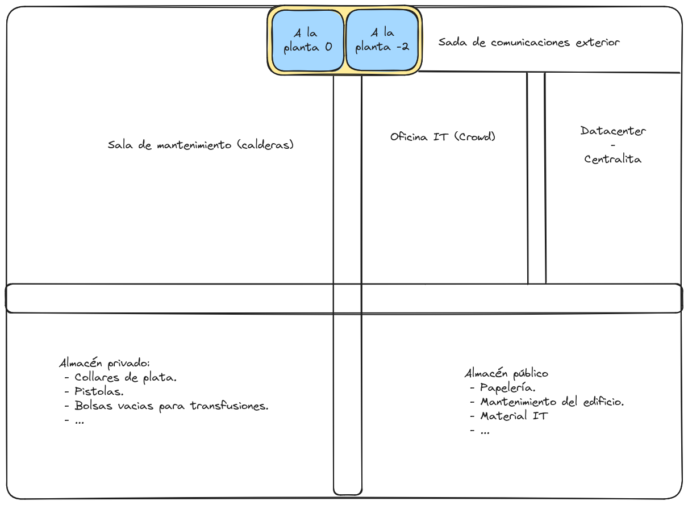
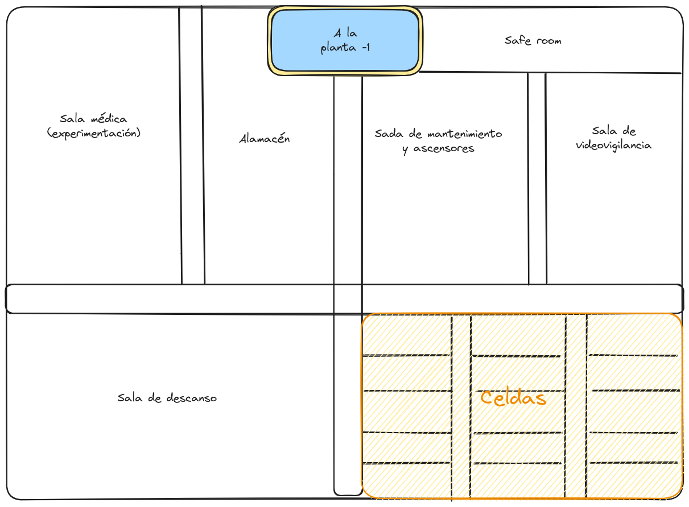

# Rascacielos. Escena del equipo de mantenimiento.

# Objetivos

  * Deshabilitar las medidas de defensa y vigilancia del edificio.
  * Apoyar y dar información al equipo de asalto.

## Setting

Rollo Blade + Juez Dredd/The Raid.  

Edificio cargado de vampiros, hombres esclavizados, hombres lobos, etc.  
  
Bonus si lo han hecho bien: Se pueden haber aliado con La Sociedad del Loto Blanco.  
  
 
  
*Notas GM*  

Dos mesas separadas pero con comunicación entre sí.  

Los PJs pueden ir a la otra mesa a ver cómo van.  
  
Los PJs saben quién es Helmut "Kuzma El Empalador" Neumeyer y que vive en el rascacielos.  
  
  
## Planta 0

El equipo llega a recepción.
Dos seguratas revisarán lo que llevan con poco entusiasmo:
 - Si los PJs no llevan nada sospechoso. Éxito automático.
 - Si los PJs han intentado ocultar lo que llevan, `éxito básico de CRIME+STEALTH`.
 - Si los PJs han pasado de todo, `exito crítico de CRIME+STEALTH` para que no les pillen.

Los seguratas les escoltan a la planta menos uno.

## Planta -1

Tras 5-10 minutos vigilando, se van a la sala de los frikis a charlar un rato (uno de los seguratas quiere instalarse Tinder pero no sabe cómo va).

Los PJs pueden:  
  * Monitorizar las **comunicaciones internas** (pinchar teléfonos):
      * Descubrir centralitas de fibra **Hackers**
      * Sin habilidad o experiencia con comunicaciones/hackea: `dificultad crítica para cortar las comunicaciones`.
      * Con habilidad o experiencia con comunicaciones/hacker: `dificultad baja para cortar las comunicaciones`.
      * Monitorizarlas sin ser detectados: `+1 dificultad`.
  * Detectar e inutilizar linea de comunicaciones al exterior de emergencia.
      * Descubrir que el sistema de alarma se dispara si se cortan los cables directamente. `dificultad básica/crítica para cortar las comunicaciones` (según experiencia).
      * Inutilizar las comunicaciones sin que salte la alarma. `dificultad básica/crítica para cortar las comunicaciones` (según experiencia).

## Planta -2

Los PJs pueden:
  * En la **Sala de videovigilancia**:
      * Hacerse con el control de la sala de vigilancia
        * Controlas camaras , alarmas...  * `dificultad crítica en FOCUS+FIX`.
        * Consecuencia: **Reduce XX minions** al equipo de asalto.
      * Hay 2 esclavos (`defensa/ataque básico)`.
      * Si hacen ruido (hay disparos o gritos): Aparecerán 4 Ghouls (`defensa/ataque crítico`).
      * Si consiguen activar la alarma (`dificultad crítica en NERVES+COOL para impedirlo`).

  * **Celdas** con humanos para alimentarse.
      * 2 humanos muertos. Consumidos completamente, como si los hubiesen drenado no sólo la sangre, si no hasta los órganos.
      * Al menos 10 humanos están muy demacrados. Apenas conscientes. Parece que son capaces de entender si se les habla, pero son casi incapaces de moverse.
      * 2 humanos bastante enteros. Están aterrados pero se les puede calmar (`dificultad básica en NERVER+COOL`).
      * **Opcional** Liberarlos.

  * En la sala médica de experimentación:
      * Hay una mesa de operaciones completamente cubierta en sangre y heces secas.
      * Armarios llenos de frascos. Algunos están etiquetados con el símbolo Ag.
      * `dificultad básica en FOCUS+DETECT` para ver un armario cerrado con candado. Dentro encontrará botes de NaCl.

  * En la sala de descanso:
      * Hay 4 Ghouls jugando a la PS5.
      * Cada 5 minutos hacen la ronda (`1d6 para ver si están en los pasillos`).

  * En la sala de mantenimiento eléctrico y ascensores:
    * `Imposible suscess en FOCUS+FIX` para hacerse con el control de la sala de mantenimiento electrico y ascensores.
