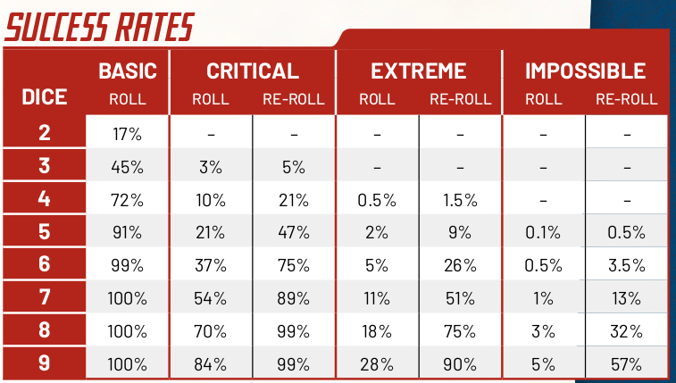

# Basic rules

## Tiradas.

Attribute + Skill ( +- Adrenaline, Conditions, and Gear).

Min 2, max 9 dice.

Éxitos:
- Basic: 2
- Critical: 3
- Extreme: 4
- Impossible: 5 
- Jackpot!: 6

Higher success than needed:
 - Better outcome than you wanted
 - Important advantage.

More successes than needed:
 - Take extra action.

Lower success:
 - Can try to do something to mitigate (partially!) the consequences of your failure.

Jackpot!:
 - Become the Director for a turn.

## Dificultad

- *Basic*. All rolls that concern really simple things but still hide a small chance for accidents.
		A quick and easy action or reaction. Like jumping over an obstacle, stealing the keys off of a distracted agent, throwing something.
- *Critical*. In most cases.
		Full action or reaction. Like bursting through a sturdy door, jumping out of a window, earning someone’s trust.

- *2 Critical rolls*. A happy medium between the Critical and Extreme.

- *Extreme*. Truly demanding rolls, where success is certainly not a given.
		A truly demanding action or reaction. Like picking the lock of a secure vault, shooting a speeding target at night in the pouring rain, per- suading a sworn enemy to cooperate.

- *Impossible*. Only come into play when Heroes have got ten themselves in big trouble.
		A desperate action or reaction. Like calmly exiting a car in the middle of a 180 while shooting at a tiny target, getting rid of a large group of enemies with nothing but a pencil, taking down a helicopter with a speeding car because you’re running low on ammo. Stuff from movie trailers.

### Double difficulty.

Especially complex or dangerous roll. 2 Basic, 2 Critical, or 2 Extreme.
- 2 successes to prevail.
- 1 successes. Avoid one of the consequences.
- Failure, 2 different consequences.

E.g. Boss. Require rolls with double difficulty in order for you to hit them or to avoid their blows.

### Combine successes:
- 3 Basic Successes into 1 Critical Success.
- 3 Critical Successes into 1 Extreme Success.
- 1 Critical Success like 3 Basic Successes.
- 1 Extreme Success like 3 Critical Successes.

### Re-roll (pg.68).

When: If you have scored at least one Basic Success, you can Re-roll.

How: you take all dice that weren’t part of a combination and roll them again.

After a Re-roll:
- If your result is better than the first, congratulations.
- Otherwise, you **lose one of the previously scored successes**. You choose which.

**Free Re-roll**
- You never risk losing your initial success.
- It doesn’t matter if the Re-roll gets you a better or extra success or not.
- You can make a Free Re-roll even if you didn’t score any successes on your first roll.

#### All in

When: After a Re-roll or Free Re-roll if you got a better result.

How: Same as re-roll.

After all in:
- If you get a better result, Lady Luck has smiled upon you.
- Otherwise, you lose all previous successes.

### Acciones extra

Extra successes:
- Extra Basic Success: Quick Action.
- Extra Critical Success: Full Action.
- Extra Extreme Success: Cool Action.

## Help

Gear or Supporting Characters can grant you Help.
Heroes can also forgo rolling the dice to spend their turn trying to Help you face a difficult challenge.

- Gain +1 to an Action or Reaction Roll.
		Significant but not decisive Help.  
		Whenever in doubt, when a Hero can rely on some Help, grant a +1.
- Gain a Success automatically, without rolling the dice.
		When the Help is great enough to nullify the risks and possibilities of failure.
- Gain a Requisite that allows you to roll the dice.

## Adrenaline (<big>&#x26A1;</big>)

**Gain**:  
- When you get a success against all odds
- when you make a great sacrifice
- when you give everyone strong emotions
- when you’re at the center of an epic and captivating scene.

Automatically gain 2 Adrenaline when they fill in the Hot Box on their Grit track.

**Spend**:  
- 1 Adrenaline (<big>&#x26A1;</big>) to gain +1 to an Action or Reaction Roll.
- 1 Adrenaline (<big>&#x26A1;</big>) to activate the special ability of some Feats.

- 6 Adrenaline ( <big> &#x26A1; &#x26A1; &#x26A1; &#x26A1; &#x26A1; &#x26A1; </big>) to immediately gain a Spotlight.

## Spotlight

6 Adrenaline -> 1 Spotlight.

**Gain**:  
Whenever an Adrenaline would be too small of a reward. Something reward for a genius, crazy, or mind-blowing move. For example:
- When a Hero calls on their Catchphrase in epic or dramatic circumstances.
- when they do something cool in the name of their ideals.
- When a Hero calls their own Flaw into play in an interesting way, against their own interest and in spite of the consequences.

**Effect**:
- Get an Extreme Success automatically.
- Save a Friend who has lost at the Death Roulette. Your friend adds another Lethal Bullet to their roulette, but at least they won’t be dead.
- Remove a Condition of any kind, including Broken.
- Save a Ride when it’s about to be destroyed.
- Do whatever you want. If you want to do something that you normally couldn’t, discuss it with the Director. If you both agree, the Spotlight makes everything possible!

**Flip a Coin**  
After using a Spotlight and gaining its benefits, flip a coin:  
- If the result is tails, you immediately regain 1 Spotlight.
- Exception when you save the life of a friend. Then, if the result is tails, they gain 1 Spotlight.

## Dangerous roles

When: action or reaction that puts your life or safety on the line. (e.g. hiding from a team of armed soldiers)

- Basic: You lose 1 Grit
- Critical: You lose 3 Grit
- Extreme: You lose 9 Grit
- Impossible: You lose All Grit

### Damage Control

TIPS:  
- PJ should call it and propose how it happens.
- When facing a tough roll, you can’t always aim for a full success, and will often have to settle for doing some Damage Control. Typical, really.

How:  
- For every Basic Success: avoid losing 1 Grit.
- For every Critical Success: avoid losing 3 Grit.

No Damage Control for an Impossible Roll.

## Grit

### Loosing grit

Effects:
- As long as you have a single open Grit box remaining, you have nothing to fear.
- Otherwise, spin on the Death Roulette and run the risk of being Left for Dead.

**Special Boxes**:
- Bad box: Suffer a Condition determined by the Director.
- Hot box: Get a rush of 2 Adrenaline.

### Gaining grit

- Sleep on it.
- Catch a Break.
- At the end of a gaming Session.

### Ejemplos de posibles consecuencias negativas.  
  
Sacar a la gente de las escenas: Dejarles inconsciente.  
  
Si les pillan, ahora saben que vais a por ellos.  
  
Consiguen la información de los fantasmas pero están malditos: Las defensas mágicas reaccionan mejor ante los PJs, aparecen espectros por que les tienen manía, etc.  
  
Si no consiguen la reliquia o la pierden: El enfrentamiento final es más jodido y El Loto Blanco no les ayuda.  
  
Si la cagan, y Taras o El Loto Blanco descubren que les han tangado, pueden dar la alarma o reforzar las defensar en futuras misiones.  
  
En la presa. Si el grupo la caga o no es muy fino, los vampiros vuelan la presa.  

## Gamble

Gamble rolls can be either Dangerous or normal.

Useful when you’re trying to build tension outside of a combat or chase.

**When**:
- You play with fire.
- You want to go all out. Gain +1 but turn your roll into a Gamble.
- You take things too far: Attempt a truly crazy action or when there’s a really good chance that everything will go wrong.

**Consecuence**:
- After roll, re-rolls or all in.
- Regardless of if they are part of a success or not.
- For every Snake Eye, you lose 1 Grit. 

## Conditions

-1 to all rolls made with that Attribute

**Broken Condition**:
- When you already have 3 Conditions and you should suffer a fourth.
- -1 to all rolls.
- Cannot receive more Conditions.

**Tired Condition**: Gives no Penalty.

#### Suffering a condition

- As a consequence of a failure.
- When you fill in the Bad Box of your Grit.
- When failure is not enough.

#### Removing a condition

Up to 2 Conditions each day. 

#### Types

**Hurt**
- Effect: -1 to Brawn.
- Acquired:  Suffer physical damage.
- Removed: Treat your wounds with a `Critical Action Roll in Focus+Heal`.

**Nervous**
- Effect: -1 to Nerves.
- Acquired: Survive danger by an inch, efforts are insufficient, damaging, or useless.
- Removed: Time-Out to relax, enjoy a hobby, or indulge a bit.

**Like a fool**
- Effect: -1 to Smooth.
- Acquired: You cover yourself in ridicule, or give your friends reasons to not trust you or to lose respect for you.
- Removed: Proving your worth, a friend cheer you up or help you find self-esteem `Critical Action Roll in Smooth+Heal`.

**Distracted**
- Effect: -1 to Focus.
- Acquired: Charmed or confused, spend a night hitting the books, etc.
- Removed: Spend `2 Adrenaline on a Focus roll`, or spend  one of your actions during a Time-Out doing absolutely nothing to clear your mind.

**Scared**
- Effect: -1 to Crime.
- Acquired: Suffer a great shock or fright.
- Removed: Facing the subject of your fear again and being victorious or, during a Time-Out, to confide in one of your friends and get the weight off your chest (both players need to spend one action).

**Tired**
- Effect: No effect.
- Acquired: Too long without eating or drinking, or when you stay up all night without getting any rest. When you fill in your Bad Box in a not-so-bad or not memorable situation
- Removed: Eating a hot meal and getting some good sleep

**Broken**
- Effect: -1 to all rolls.
- Acquired: When you should suffer a fourth Condition. If you already look Tired and Hurt.
- Removed: Spending a couple of days in a hospital or a friend treat your wounds with `extreme Action Roll in Focus+Heal`.

Other conditions: (pg. 93)
- Disheartened.
- Confused.
- Angry.

## Death Roulette

When:  
  When lost all Grit, the next failure in a Roll will force you to take a spin on the Death Roulette.

### Cannon fodder
Basic Cannon Fodder:    9 GRIT      ATK: 2 BASIC        DEF: BASIC
Critical Cannon Fodder: 9 GRIT      ATK: CRITICAL       DEF: CRITICA

## Combat

Order:
  1. Action.
      - Quick Action. Examples:
          - Grab or toss an object.
          - Reload a weapon.
          - Reach an Enemy who is in Close Range.
      - Action Roll (complex action). Example:
          - Attacking the Enemy.
    
  2. Reaction.
  3. Go to 1.

### Initiative

PJs:
- If the Heroes are the first to attack.
- Can rely on the element of surprise.

PNJs:
- Heroes are caught by surprise, or hesitate before acting.

When in doubt:
- Flip a coin.

### Action

Attack are direct actions against an enemy (non collateral actions)

  - **Difficulty** equal to the Enemy Defense.
  - For every success, the Enemy loses 1 Grit.
  - Examples:
      - Enemy with Basic Defense:
          - 2 Basic Successes    : Enemy loses 2 Grit.
          - 1 Critical Success   : Enemy loses 3 Grit.

Examples of attacks.
  - Melee                                   : `Brawn+Fight`.
  - Ram with the car                        : `Nerves+Drive`.
  - knock scaffolding down over their heads : `Focus+Fix`.

### Reaction

All Reaction Rolls made during combat are **Dangerous Rolls**.

  - Difficulty equal to the Enemy Attack.
  - If fail, lose some Grit.
      - **Optional, Damage Control**. Can spend smaller successes to do some Damage Control.

Examples of reactions.
  - Attack with fists and metal bars : `Brawn+Fight`
  - Shoot at you                     : `Brawn+Stunt`
  - Try to crush or choke you        : `Brawn+Endure`
  - Try to push you the ground       : `Brawn+Force`
  - Throw tables and chairs at you   : `Nerves+Stealth`
  - Try to surround you              : `Nerves+Awareness`

As a general rule, all Heroes taking part in combat must make the same Reaction Roll.

Usually, all Heroes fighting against the same Enemy defend themselves by making the same Reaction Roll with the same Attribute and Skill.

In corner cases, when the situation benefits from it, each Hero can make a different Reaction Roll based on their situation.
  This adds complexity and make combat longer.

#### Extra Reactions

You can spend **extra successes** during a Reaction Turn to take extra actions.

**Extra success** at least equal to the Enemy Defense: you can counterattack.

Examples:
  - Counterattack:
      1. Reaction Roll against an Enemy with Critical Attack and Defense.
      2. You score 2 Critical Successes.
        - Use 1 success to defend.
        - Spend the second to counter and cause the Enemy to lose 1 Grit.
  - Protect your friends:
      - Spend extra successes scored during a Reaction Turn to protect your friends who may have failed their Reaction Rolls.
      - You can NOT use lower successes to do Damage Control for them.

